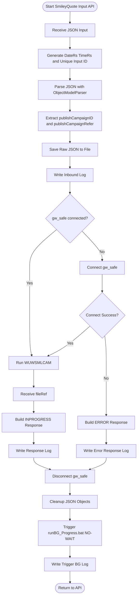
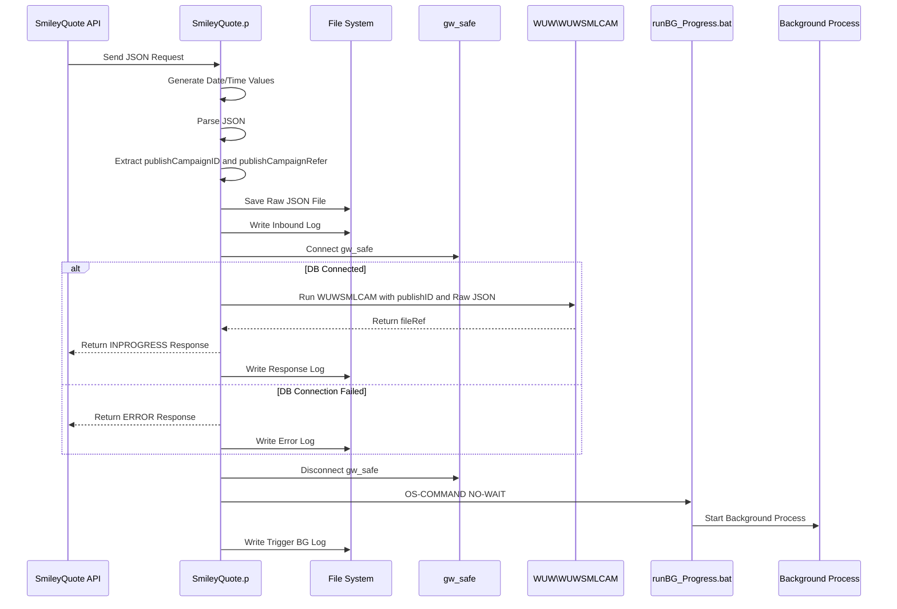

# SmileyQuote Main Input API Receiver and Background Trigger

**Program:** `SmileyQuote.p`  
**Process Type:** Input API / API Receiver / Background Trigger  
**Purpose:** รับ JSON จาก API SmileyQuote, บันทึก Raw JSON ลงไฟล์, บันทึกข้อมูลอ้างอิงลง `gw_safe`, ตอบกลับ API ทันที และ Trigger Background Process ผ่าน BAT File  
**Company:** Tokio Marine Safety Insurance (Thailand) Public Company Limited  
**Created By:** Manop G.  
**Document Version:** 1.0  
**Generated Date:** 2026-07-20

---

## 1. Objective

โปรแกรมนี้เป็น Main Program สำหรับรับ Request จาก API SmileyQuote โดยออกแบบให้ทำงานแบบ **Receive and Acknowledge** คือรับข้อมูลแล้วตอบกลับ API ทันทีว่าเข้าสู่ระบบแล้ว (`INPROGRESS`) จากนั้นจึง Trigger Background Process ไปทำงานต่อแบบไม่ Block API

หน้าที่หลักของโปรแกรม:

1. รับ JSON Request จาก API
2. Parse ค่า `publishCampaignID` และ `publishCampaignRefer`
3. Save Raw JSON ลงไฟล์ `.json`
4. เขียน Log การรับข้อมูล
5. Connect Database `gw_safe`
6. เรียก `WUW\WUWSMLCAM` เพื่อบันทึก Queue / File Reference
7. สร้าง Response กลับ API เป็น `INPROGRESS` หรือ `ERROR`
8. Disconnect Database
9. Trigger Background Process ด้วย `OS-COMMAND NO-WAIT`
10. เขียน Log การ Trigger Background

---

## 2. Input / Output Parameters

| Parameter | Direction | Type | Description |
|---|---|---|---|
| `json` | Input | `LONGCHAR` | JSON Request จาก API SmileyQuote |
| `jsonRS` | Output | `LONGCHAR` | JSON Response ที่ส่งกลับ API |

---

## 3. Expected Input JSON

โปรแกรมอ่าน Field จาก JSON ดังนี้:

```json
{
  "publishCampaignID": "10001",
  "publishCampaignRefer": "REF202607001"
}
```

| JSON Field | Target Variable | Required | Description |
|---|---|---|---|
| `publishCampaignID` | `publishID` | Yes | Campaign ID / Publish ID |
| `publishCampaignRefer` | `publishRefer` | Yes | Campaign Reference จาก SmileyQuote |

---

## 4. Output Response JSON

### 4.1 Success Response: `INPROGRESS`

กรณี Connect `gw_safe` สำเร็จ และลง Queue ผ่าน `WUW\WUWSMLCAM` สำเร็จ:

```json
{
  "publishCampaignID": "10001",
  "Refer": "REF202607001",
  "DateRs": "20260720",
  "TimeRs": "15:38:00",
  "ErrorRs": "",
  "Status": "INPROGRESS",
  "FileRef": "<file reference>"
}
```

### 4.2 Error Response: Database Connection Failed

กรณี Connect `gw_safe` ไม่สำเร็จ:

```json
{
  "publishID": "10001",
  "Refer": "REF202607001",
  "DateRs": "20260720",
  "TimeRs": "15:38:00",
  "ErrorRs": "Cannot Connect Database Premium",
  "Status": "ERROR"
}
```

---

## 5. Related Components

| Component | Description |
|---|---|
| `SmileyQuote.p` | Program รับ API Request |
| `ObjectModelParser` | ใช้ Parse JSON Input |
| `JsonObject` | ใช้อ่านค่า Field ใน JSON |
| `gw_safe` | Database สำหรับบันทึก Queue / Control Data |
| `WUW\WUWSMLCAM` | Program สำหรับบันทึกข้อมูล Queue / File Reference |
| `runBG_Progress.bat` | BAT File สำหรับ Trigger Background Process |

---

## 6. File and Log Output

| Path / File | Purpose |
|---|---|
| `D:\smileyquote\Json\JsonID_<publishID>_<datetime>.json` | Save Raw JSON Request |
| `D:\smileyquote\00LogIn_Smiley_<YYYYMM>.TXT` | Log การรับ Request และ Response |
| `D:\smileyquote\Batch\runBG_Progress.bat` | BAT สำหรับ Run Background Process |
| `D:\smileyquote\Log\01SmileyQuote.log` | Log การ Trigger Background |

---

## 7. Overall Flow Diagram



---

## 8. Sequence Diagram



---

## 9. Detailed Process Steps

### Step 1: รับ JSON Request จาก API

โปรแกรมรับ Input Parameter:

```progress
DEFINE INPUT  PARAMETER json   AS LONGCHAR NO-UNDO.
DEFINE OUTPUT PARAMETER jsonRS AS LONGCHAR NO-UNDO.
```

`json` คือ Payload ที่ส่งมาจาก SmileyQuote ส่วน `jsonRS` คือ Response ที่จะส่งกลับ

---

### Step 2: เตรียมตัวแปรสำหรับ JSON และ Response

โปรแกรมประกาศตัวแปรสำหรับ Parse JSON:

```progress
DEFINE VARIABLE oParser AS ObjectModelParser NO-UNDO.
DEFINE VARIABLE oRoot   AS JsonObject NO-UNDO.
```

และตัวแปรสำหรับเก็บข้อมูลสำคัญ เช่น:

- `publishID`
- `publishRefer`
- `filejson`
- `fileout`
- `fileref`
- `DateRs`
- `TimeRs`

---

### Step 3: Generate Date / Time Key

โปรแกรมสร้างค่า `nv_NewInput`, `DateRs`, `TimeRs` จากวันที่และเวลาปัจจุบัน

ตัวอย่างผลลัพธ์:

```text
DateRs = 20260720
TimeRs = 15:38:00
```

ค่าเหล่านี้ใช้สำหรับ Response และการตั้งชื่อไฟล์ / Log

---

### Step 4: Parse JSON Request

โปรแกรม Parse JSON:

```progress
oParser = NEW ObjectModelParser().
oRoot = CAST(oParser:Parse(json), JsonObject).
```

จากนั้นอ่านค่า:

```progress
publishID = TRIM(STRING(oRoot:GetCharacter("publishCampaignID"))).
publishRefer = TRIM(STRING(oRoot:GetCharacter("publishCampaignRefer"))).
```

---

### Step 5: Save Raw JSON ลงไฟล์

กำหนด Codepage เป็น UTF-8:

```progress
FIX-CODEPAGE(myLongchar) = 'UTF-8'.
myLongchar = json.
```

สร้างชื่อไฟล์:

```text
D:\smileyquote\Json\JsonID_<publishID>_<datetime>.json
```

แล้วเขียน Raw JSON ลงไฟล์

---

### Step 6: เขียน Inbound Log

โปรแกรมเขียน Log ลงไฟล์รายเดือน:

```text
D:\smileyquote
