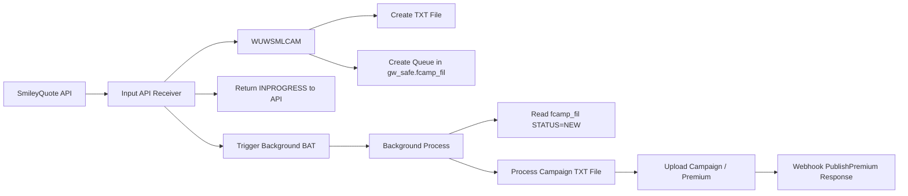
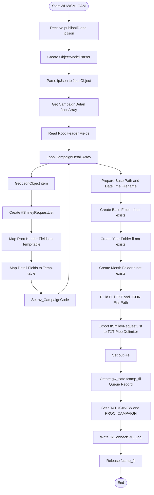
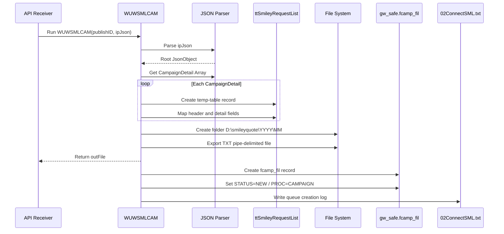
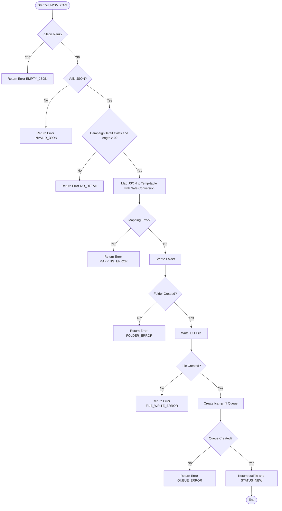

# SmileyQuote JSON to Campaign File Queue (WUWSMLCAM.p)

**Program:** `WUW\WUWSMLCAM`  
**Process Type:** Sub Program / JSON Parser / File Generator / Queue Registrar  
**Purpose:** รับ Raw JSON จาก Input API, แปลงข้อมูล `CampaignDetail` เป็น Temp-table, Export เป็นไฟล์ `.txt` แบบ Pipe Delimiter และสร้างรายการ Queue ใน `gw_safe.fcamp_fil` เพื่อให้ Background Process นำไปประมวลผลต่อ  
**Company:** Tokio Marine Safety Insurance (Thailand) Public Company Limited  
**Created By:** Manop G.  
**Document Version:** 1.0  
**Generated Date:** 2026-07-20

---

## 1. Objective

เอกสารนี้อธิบายการทำงานของโปรแกรม `WUW\WUWSMLCAM` ซึ่งเป็น Sub Program ที่ถูกเรียกจาก API Receiver หลังจากรับ JSON จาก SmileyQuote แล้ว

หน้าที่หลักของโปรแกรมนี้คือ:

1. รับ `publishID` และ Raw JSON จากโปรแกรมหลัก
2. Parse JSON ด้วย `ObjectModelParser`
3. อ่าน Header Level เช่น `publishCampaignRefer`, `publishCampaignDate`, `EffectivePeriod`, `ExpiredPeriod`, `CampaignName`
4. อ่าน Array `CampaignDetail`
5. Map รายการใน `CampaignDetail` ลง Temp-table `ttSmileyRequestList`
6. สร้าง Folder ตามปีและเดือนภายใต้ `D:\smileyquote\`
7. Export Temp-table เป็นไฟล์ `.txt` แบบ Pipe Delimiter `|`
8. Return ชื่อไฟล์กลับไปยัง Caller ผ่าน `outFile`
9. Create Queue Record ใน `gw_safe.fcamp_fil`
10. กำหนด Queue Status เป็น `STATUS=NEW` และ Process Type เป็น `PROC=CAMPAIGN`
11. เขียน Log ลง `D:\smileyquote\Log\02ConnectSML.txt`

---

## 2. Position in End-to-End Flow



---

## 3. Input / Output Parameters

| Parameter | Direction | Type | Description |
|---|---|---|---|
| `publishID` | Input | `CHARACTER` | Publish Campaign ID ที่รับมาจาก API Receiver |
| `ipJson` | Input | `LONGCHAR` | Raw JSON Payload จาก SmileyQuote |
| `outFile` | Output | `LONGCHAR` | ชื่อไฟล์ `.txt` ที่สร้างขึ้น เพื่อส่งกลับไปยัง API Receiver |

---

## 4. Expected JSON Structure

โปรแกรมคาดหวัง JSON Root ที่มี Header Field และ Array ชื่อ `CampaignDetail`

```json
{
  "publishCampaignRefer": "REF202607001",
  "publishCampaignDate": "20260720",
  "EffectivePeriod": "20260720",
  "ExpiredPeriod": "20270720",
  "CampaignName": "Campaign Name",
  "CampaignDetail": [
    {
      "CampaignKeyId": 1,
      "CompanyCode": "TMSTH",
      "CampaignCode": "CMP001",
      "Polmst": "POL001",
      "Pack": "1",
      "Sclass": "110",
      "Covcod": "1"
    }
  ]
}
```

---

## 5. Main Temp-table

โปรแกรมสร้าง Temp-table ชื่อ:

```progress
DEFINE TEMP-TABLE ttSmileyRequestList NO-UNDO
```

Temp-table นี้ใช้เป็นพื้นที่กลางสำหรับรับข้อมูลจาก JSON ก่อน Export ออกเป็น `.txt`

กลุ่มข้อมูลสำคัญใน Temp-table ได้แก่:

| Group | Example Fields | Description |
|---|---|---|
| Campaign Header | `CampaignRefer`, `publishDate`, `EffectivePeriod`, `ExpiredPeriod`, `CampaignName` | ข้อมูล Header จาก Root JSON |
| Policy / Vehicle | `CompanyCode`, `CampaignCode`, `Polmst`, `Pack`, `Sclass`, `Covcod`, `Vehgrp`, `Vehuse` | ข้อมูล Campaign และความคุ้มครอง |
| Vehicle Model | `GarageCd`, `Makdes`, `Moddes`, `CSTFlag`, `MinYear`, `MaxYear`, `MinCst`, `MaxCst` | ข้อมูลรถและเงื่อนไขรถ |
| Sum Insured | `MinSi`, `MaxSi`, `Si22`, `NetInputGap`, `GrossInputGap` | ทุนประกัน / SI / GAP |
| Driver | `DriverName`, `DrivNo`, `DrivAge1`, `DrivAge2`, `MinEVDrivNo`, `MaxEVDrivNo` | ข้อมูลผู้ขับขี่ |
| Premium | `Baseprm1`, `MainPrem`, `VehicleUsePrem`, `EnginePrem`, `DriverPrem` | เบี้ยหลักและส่วนประกอบ |
| Discount / Loading | `FleetPer`, `NcbPer`, `DspcPer`, `LoadclmPer`, `Dstfper` | ส่วนลดและ Loading |
| PA / Add-on | `Mv411`, `Mv412`, `Mv413`, `Mv414`, `Mv42`, `Mv43` | ความคุ้มครองเพิ่มเติม |
| EV | `BehaviorLV`, `WallChargeSI`, `BatteryYear`, `BatterySI`, `RateBattery` | ข้อมูล EV / Charger / Battery |
| Dealer Garage | `DealerGarageRate`, `DealerGarageAmount` | M.V.31 Dealer Garage |

---

## 6. Overall Process Flow



---

## 7. Sequence Diagram



---

## 8. Detailed Process Steps

### Step 1: รับ Parameter จาก API Receiver

โปรแกรมรับค่า:

```progress
DEFINE INPUT  PARAMETER publishID AS CHARACTER NO-UNDO.
DEFINE INPUT  PARAMETER ipJson    AS LONGCHAR  NO-UNDO.
DEFINE OUTPUT PARAMETER outFile   AS LONGCHAR  NO-UNDO.
```

ความหมาย:

- `publishID` คือ Campaign Publish ID จาก API
- `ipJson` คือ Raw JSON Payload
- `outFile` คือชื่อไฟล์ `.txt` ที่จะส่งกลับไปให้ Caller ใช้เป็น File Reference

---

### Step 2: สร้าง JSON Parser

โปรแกรมสร้าง `ObjectModelParser` และ Parse `ipJson`

```progress
oParser = NEW ObjectModelParser().
oRoot   = CAST(oParser:Parse(ipJson), JsonObject).
oArray  = oRoot:GetJsonArray("CampaignDetail").
```

หาก JSON ไม่ถูกต้อง หรือไม่มี `CampaignDetail` โปรแกรมมีโอกาส Error เพราะยังไม่มี `NO-ERROR` หรือ `CATCH`

---

### Step 3: อ่าน Header Field จาก Root JSON

โปรแกรมอ่านข้อมูล Header เช่น:

```progress
nv_CampaignRefer = STRING(oRoot:GetCharacter("publishCampaignRefer")) .
```

และใน Loop จะ Assign ค่า Root Header ลง Temp-table:

- `publishCampaignRefer` -> `CampaignRefer`
- `publishCampaignDate` -> `publishDate`
- `EffectivePeriod` -> `EffectivePeriod`
- `ExpiredPeriod` -> `ExpiredPeriod`
- `CampaignName` -> `CampaignName`

---

### Step 4: Loop รายการ `CampaignDetail`

โปรแกรม Loop Array จากลำดับที่ 1 ถึง `oArray:Length`

```progress
DO i = 1 TO oArray:Length:
    oItem = oArray:GetJsonObject(i).
    CREATE ttSmileyRequestList.
    ...
END.
```

ในแต่ละรอบจะสร้าง Record ใหม่ใน `ttSmileyRequestList`

---

### Step 5: Map JSON Detail ลง Temp-table

โปรแกรม Map Field จำนวนมากจาก `oItem` ลง `ttSmileyRequestList`

ตัวอย่าง Mapping:

```progress
ttSmileyRequestList.CompanyCode  = oItem:GetCharacter("CompanyCode")
ttSmileyRequestList.CampaignCode = oItem:GetCharacter("CampaignCode")
ttSmileyRequestList.Polmst       = oItem:GetCharacter("Polmst")
ttSmileyRequestList.Pack         = oItem:GetCharacter("Pack")
ttSmileyRequestList.Sclass       = oItem:GetCharacter("Sclass")
ttSmileyRequestList.Covcod       = oItem:GetCharacter("Covcod")
```

กรณี `Vehuse` มีการ Check Null:

```progress
ttSmileyRequestList.Vehuse = IF oItem:IsNull("Vehuse") THEN "" ELSE oItem:GetCharacter("Vehuse")
```

---

### Step 6: เก็บ CampaignCode สุดท้ายไว้ใน `nv_CampaignCode`

ใน Loop มีการ Assign:

```progress
nv_CampaignCode = ttSmileyRequestList.CampaignCode.
```

หมายความว่าเมื่อ Loop จบ `nv_CampaignCode` จะเป็นค่า `CampaignCode` ของรายการสุดท้ายใน Array

---

### Step 7: เตรียมชื่อไฟล์และ Folder

Base Path ถูกกำหนดเป็น:

```progress
nv_basepath = "D:\smileyquote\".
```

สร้าง Folder ตามปีและเดือน:

```text
D:\smileyquote\YYYY\MM\
```

ตัวอย่าง:

```text
D:\smileyquote\2026\07\
```

---

### Step 8: สร้างชื่อไฟล์ TXT / JSON

สร้างชื่อไฟล์จาก `publishID` และ DateTime:

```progress
nv_filetxt  = "CampaignID_" + publishID + "_" + cDateTime + ".txt".
nv_filejson = "CampaignID_" + publishID + "_" + cDateTime + ".json".
outFile     = nv_filetxt.
```

> หมายเหตุ: `outFile` ถูก Set ก่อนนำ `nv_filetxt` ไปต่อกับ Full Path ดังนั้น Caller จะได้รับเฉพาะชื่อไฟล์ ไม่ใช่ Full Path

---

### Step 9: สร้าง Folder ถ้ายังไม่มี

โปรแกรมตรวจสอบและสร้าง Folder:

1. Base Path: `D:\smileyquote\`
2. Year Folder: `D:\smileyquote\YYYY\`
3. Month Folder: `D:\smileyquote\YYYY\MM\`

ถ้าสร้างไม่สำเร็จจะ `RETURN`

---

### Step 10: Export Temp-table เป็นไฟล์ TXT

สร้าง Full Path:

```progress
nv_filetxt = cMonthPath + nv_filetxt.
```

แล้ว Export Temp-table เป็น Pipe Delimiter:

```progress
OUTPUT TO VALUE(nv_filetxt).
FOR EACH ttSmileyRequestList:
    PUT field1 "|" field2 "|" ... SKIP.
END.
OUTPUT CLOSE.
```

Output File จะถูกใช้โดย Background Process ในขั้นตอนถัดไป

---

### Step 11: Create Queue Record ใน `gw_safe.fcamp_fil`

หลังสร้างไฟล์สำเร็จ โปรแกรม Create Record:

```progress
CREATE gw_safe.fcamp_fil.
```

แล้ว Assign ข้อมูลหลัก:

```progress
gw_safe.fcamp_fil.CampCode = publishID
gw_safe.fcamp_fil.CampName = nv_CampaignCode
gw_safe.fcamp_fil.btyp     = nv_CampaignRefer
gw_safe.fcamp_fil.Trndat   = TODAY
gw_safe.fcamp_fil.Remark1  = "FILE=" + nv_filetxt
gw_safe.fcamp_fil.Remark2  = "PATH=" + nv_filepath
gw_safe.fcamp_fil.Remark3  = "STATUS=NEW"
gw_safe.fcamp_fil.Remark4  = "PROC=CAMPAIGN"
gw_safe.fcamp_fil.Remark5  = nv_CampaignRefer
```

---

### Step 12: เขียน Queue Log

โปรแกรมเขียน Log ลง:

```text
D:\smileyquote\Log\02ConnectSML.txt
```

ข้อความประมาณ:

```text
============================================================
20/07/2026 15:38:00 : Process GW_SAFE STATUS=NEW FILE = D:\smileyquote\2026\07\CampaignID_10001_20260720153800.txt
```

---

### Step 13: Release Record

หลัง Create Queue เสร็จ โปรแกรม Release Record:

```progress
RELEASE gw_safe.fcamp_fil.
```

---

## 9. Process Summary แบบเรียงลำดับทีละข้อ

1. Program เริ่มต้นและรับ `publishID`, `ipJson`, `outFile`
2. Program สร้าง JSON Parser
3. Program Parse `ipJson` เป็น `JsonObject`
4. Program อ่าน `CampaignDetail` เป็น `JsonArray`
5. Program อ่าน `publishCampaignRefer` จาก Root JSON
6. Program Loop ทุก Item ใน `CampaignDetail`
7. ในแต่ละ Item สร้าง Record ใหม่ใน `ttSmileyRequestList`
8. Program Map Header Field จาก Root JSON ลง Temp-table
9. Program Map Detail Field จาก `CampaignDetail` ลง Temp-table
10. Program Convert Type เช่น Character, Decimal, Integer, Logical ตาม Field ปลายทาง
11. Program Set `nv_CampaignCode` จาก `CampaignCode`
12. เมื่อ Loop ครบ Program เตรียม Base Path `D:\smileyquote\`
13. Program สร้างค่า `cYear`, `cMonth`, `cDateTime`
14. Program สร้างชื่อไฟล์ `.txt` และ `.json`
15. Program Set `outFile` เป็นชื่อไฟล์ `.txt`
16. Program ตรวจสอบและสร้าง Base Folder ถ้ายังไม่มี
17. Program ตรวจสอบและสร้าง Year Folder ถ้ายังไม่มี
18. Program ตรวจสอบและสร้าง Month Folder ถ้ายังไม่มี
19. Program ประกอบ Full Path ของไฟล์ `.txt`
20. Program Export Temp-table เป็น Pipe Delimiter File
21. Program Close Output File
22. Program Create Record ใน `gw_safe.fcamp_fil`
23. Program Assign `CampCode = publishID`
24. Program Assign `CampName = nv_CampaignCode`
25. Program Assign `btyp = nv_CampaignRefer`
26. Program Assign `Remark1 = FILE=<txt file>`
27. Program Assign `Remark2 = PATH=<path>`
28. Program Assign `Remark3 = STATUS=NEW`
29. Program Assign `Remark4 = PROC=CAMPAIGN`
30. Program Assign `Remark5 = nv_CampaignRefer`
31. Program เขียน Log ลง `02ConnectSML.txt`
32. Program Release `gw_safe.fcamp_fil`
33. Program จบการทำงานและส่ง `outFile` กลับ Caller

---

## 10. Output TXT File Format

ไฟล์ `.txt` ที่สร้างจะเป็น Pipe Delimiter `|` โดยแต่ละบรรทัดแทน 1 รายการ Campaign Detail

ตัวอย่างโครงสร้างโดยย่อ:

```text
CompanyCode|CampaignCode|Polmst|Pack|Sclass|Covcod|Vehgrp|Vehuse|GarageCd|Makdes|Moddes|...|EffectivePeriod|ExpiredPeriod|CampaignName
```

ไฟล์นี้จะถูก Background Process อ่านต่อในขั้นตอนถัดไป และ Import เข้าสู่ Temp-table `tFile`

---

## 11. Queue Record Specification: `gw_safe.fcamp_fil`

| Field | Source / Value | Description |
|---|---|---|
| `CampCode` | `publishID` | Publish Campaign ID |
| `CampName` | `nv_CampaignCode` | Campaign Code จากรายการสุดท้ายใน detail |
| `btyp` | `nv_CampaignRefer` | Campaign Reference |
| `Trndat` | `TODAY` | Transaction Date |
| `puserid` | `LDBNAME(1)` | Database/User Context |
| `entdat` | `TODAY` | Entry Date |
| `Endtime` | `STRING(TIME,"HH:MM:SS")` | Entry Time |
| `Remark1` | `FILE=` + `nv_filetxt` | File Name / Full File Path |
| `Remark2` | `PATH=` + `nv_filepath` | Path สำหรับ Background Process |
| `Remark3` | `STATUS=NEW` | Queue Status เริ่มต้น |
| `Remark4` | `PROC=CAMPAIGN` | Process Type |
| `Remark5` | `nv_CampaignRefer` | Campaign Reference |

---

## 12. Technical Findings / Recommendations

### 12.1 `nv_filepath` ไม่ได้ถูก Assign ค่า

ในโค้ดมีตัวแปร:

```progress
DEFINE VARIABLE nv_filepath AS CHAR INIT "".
```

แต่ไม่พบการ Assign ค่า ก่อนนำไปใช้:

```progress
gw_safe.fcamp_fil.Remark2 = "PATH=" + nv_filepath
```

ผลคือ `Remark2` อาจเป็นเพียง:

```text
PATH=
```

**Recommendation:** กำหนด `nv_filepath = cMonthPath` ก่อน Create Queue

```progress
nv_filepath = cMonthPath.
```

---

### 12.2 `Remark1` เก็บ Full Path แต่ชื่อ Field สื่อว่า FILE

ปัจจุบัน หลังจากต่อ Full Path แล้ว:

```progress
nv_filetxt = cMonthPath + nv_filetxt.
Remark1 = "FILE=" + nv_filetxt
```

ดังนั้น `Remark1` จะกลายเป็น Full Path ไม่ใช่เฉพาะชื่อไฟล์

แต่ Background Process ก่อนหน้า Extract แบบ:

```progress
cFile = ENTRY(2, Remark1, "=").
cPath = ENTRY(2, Remark2, "=").
cFullPath = cPath + "\" + cFile.
```

ถ้า `Remark1` เป็น Full Path และ `Remark2` ว่าง อาจเกิด Path ผิดซ้ำซ้อนหรือหาไฟล์ไม่เจอ

**Recommendation:** เลือก Pattern ให้ชัดเจนอย่างใดอย่างหนึ่ง

Pattern A:

```text
Remark1 = FILE=CampaignID_10001_20260720153800.txt
Remark2 = PATH=D:\smileyquote\2026\07
```

Pattern B:

```text
Remark1 = FILE=D:\smileyquote\2026\07\CampaignID_10001_20260720153800.txt
Remark2 = PATH=
```

แล้ว Background Process ต้องอ่านให้สอดคล้องกัน

---

### 12.3 `outFile` คืนค่าเฉพาะ File Name ไม่ใช่ Full Path

โค้ด Set:

```progress
outFile = nv_filetxt.
```

ก่อนจะเปลี่ยน `nv_filetxt` เป็น Full Path ดังนั้น Caller ได้เฉพาะชื่อไฟล์

ถ้าต้องการส่ง Full Path กลับ ควร Set หลังประกอบ Path แล้ว หรือเพิ่ม Output อีกตัว เช่น `outFullPath`

---

### 12.4 ยังไม่ได้ Save `.json` File ใน Program นี้

โค้ดสร้างตัวแปรและชื่อไฟล์ JSON:

```progress
nv_filejson = "CampaignID_" + publishID + "_" + cDateTime + ".json".
```

แต่ไม่พบการ Write JSON ลงไฟล์ในโปรแกรมนี้

ถ้าไม่ใช้ควรถอดออก หรือถ้าต้องการเก็บ JSON ควรเพิ่มขั้นตอน Write File

---

### 12.5 JSON Parse ไม่มี Error Handling

หาก `ipJson` ไม่ใช่ JSON ที่ถูกต้อง หรือไม่มี `CampaignDetail` โปรแกรมอาจ Error ทันที

ควรเพิ่ม `DO ON ERROR` หรือ `NO-ERROR` และ Return Error กลับ Caller

---

### 12.6 การ Convert Type มีความเสี่ยง Error

หลาย Field ใช้การ Convert เช่น:

```progress
DECIMAL(oItem:GetCharacter("FleetPer"))
INT(oItem:GetCharacter("DrivNo"))
LOGICAL(oItem:GetCharacter("DriverName"))
```

ถ้า JSON ส่งค่าว่าง, Null, หรือ String ที่ Convert ไม่ได้ จะเกิด Error

ควรมี Helper Function เช่น:

- `SafeDecimal()`
- `SafeInteger()`
- `SafeLogical()`
- `SafeCharacter()`

---

### 12.7 `ListNo = INT(oItem)` อาจไม่ถูกต้อง

โค้ดปัจจุบัน:

```progress
ttSmileyRequestList.ListNo = INT(oItem)
```

`oItem` เป็น JsonObject จึงควรใช้ลำดับ `i` หรือ Field ที่ชัดเจน เช่น:

```progress
ttSmileyRequestList.ListNo = i.
```

---

### 12.8 ควรใช้ Transaction ในการ Create Queue

การ Export File และ Create `fcamp_fil` ควรควบคุมให้สัมพันธ์กัน หากไฟล์สร้างสำเร็จแต่ Create Queue ไม่สำเร็จ Background Process จะไม่รู้ว่ามีไฟล์

ควรออกแบบ Error Handling เช่น:

1. ถ้า Create File สำเร็จ แต่ Create Queue Fail ให้ Log Error และ Return Error
2. ถ้า Create Queue สำเร็จ แต่ File ไม่มีจริง ให้ Mark `STATUS=ERROR`

---

### 12.9 ควรตรวจสอบ Empty `CampaignDetail`

ถ้า `CampaignDetail` ว่าง โปรแกรมยังอาจสร้างไฟล์ว่างและ Queue ได้

ควร Validate:

```text
CampaignDetail length > 0
```

---

## 13. Recommended Improved Flow



---

## 14. Business Summary

`WUW\WUWSMLCAM` เป็น Program ตัวกลางระหว่าง API Receiver และ Background Campaign Processor โดยมีหน้าที่แปลง JSON จาก SmileyQuote ให้อยู่ในรูปแบบ Text File ที่ระบบ Background Process อ่านได้

หลังจากสร้าง Text File แล้ว Program จะสร้าง Queue Record ใน `gw_safe.fcamp_fil` ด้วยสถานะ:

```text
STATUS=NEW
PROC=CAMPAIGN
```

เพื่อให้ Background Process ดึงไปทำงานต่อ เช่น Validate Campaign, Upload Premium, Generate Premium Detail และส่ง Webhook Response กลับไปยัง API

---

## 15. Suggested Next Documents

1. Data Mapping Specification: JSON `CampaignDetail` -> `ttSmileyRequestList` -> TXT File -> `tFile`
2. SIT Test Case สำหรับ WUWSMLCAM
3. Error Handling Specification สำหรับ JSON Mapping Error
4. File Naming and Folder Structure Standard
5. Queue Control Table Specification: `gw_safe.fcamp_fil`
