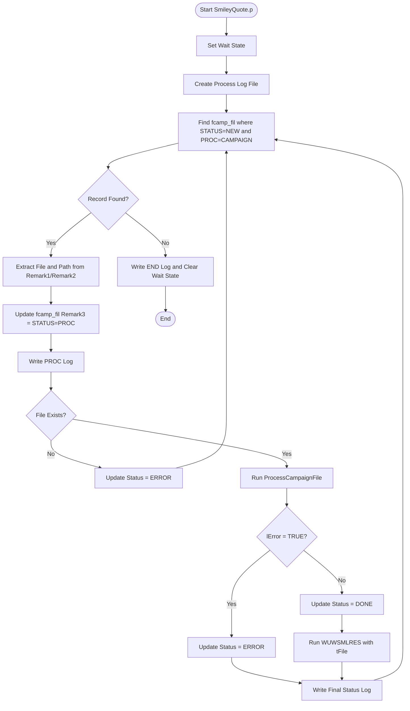
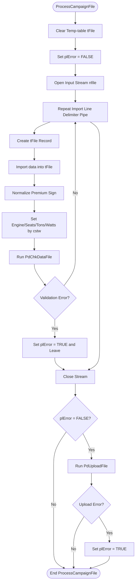
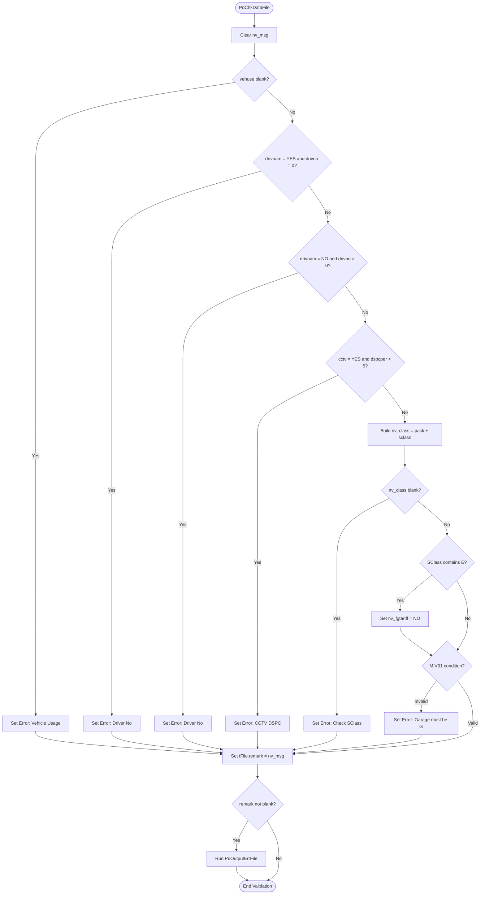
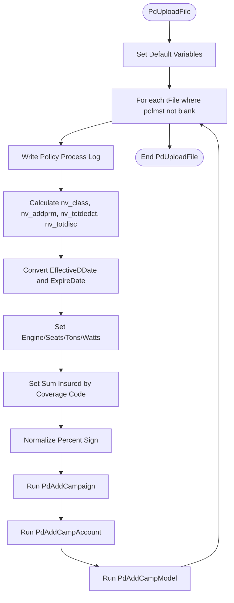
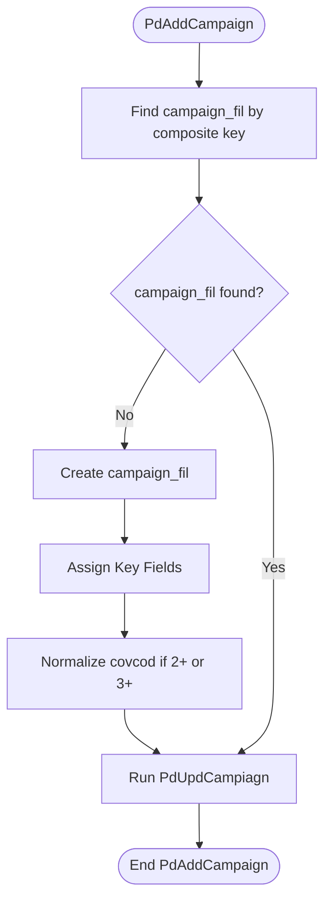
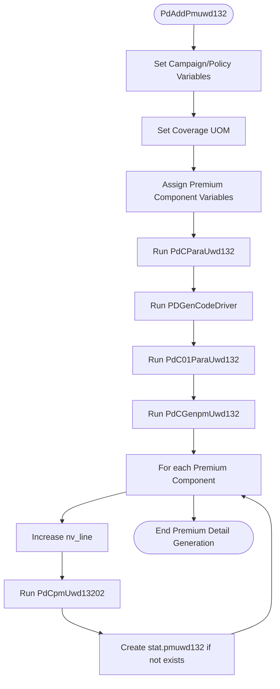
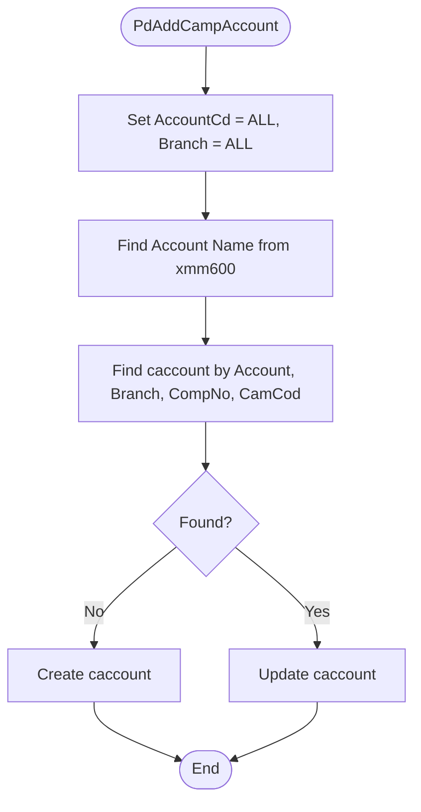
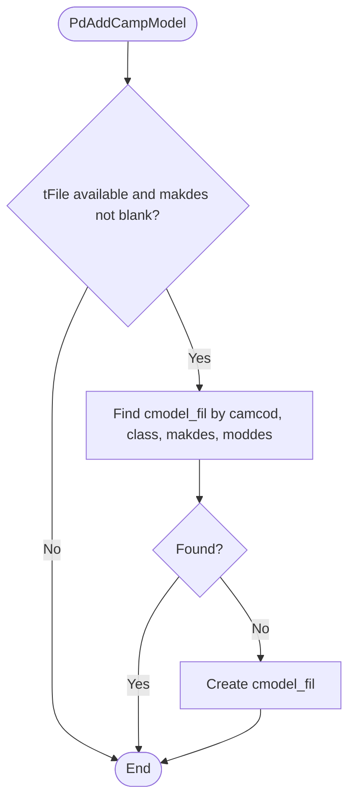
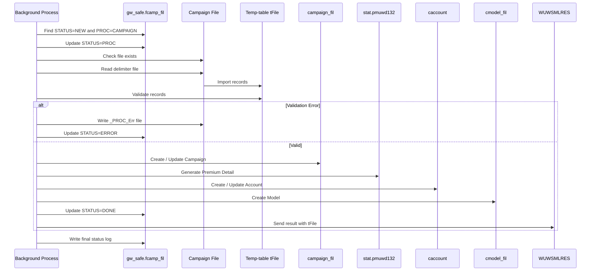

#  SmileyQuote Campaign File Processing (WUWSMLPRM)

**Program:** `WUWSMLPRM.p`  
**Process Type:** Background / Batch Process  
**Purpose:** อ่านรายการ Campaign File จาก SmileyQuote แล้ว Import, Validate และ Upload ข้อมูล Campaign เข้าสู่ระบบ OpenEdge  
**Owner / Created By:** Manop G.  
**Company:** Tokio Marine Safety Insurance (Thailand) Public Company Limited  
**Document Version:** 1.0  
**Generated Date:** 2026-07-20

---

## 1. Objective


เอกสารนี้อธิบายลำดับการทำงานของโปรแกรม `WUWSMLPRM.p` ซึ่งทำหน้าที่เป็น Background Process หลังจากรัน `runBG_Progress.bat` จะเริ่มทำงานที่โปรแกรมนี้ สำหรับอ่านไฟล์ Campaign จาก SmileyQuote โดยทำงานกับข้อมูลในตาราง `gw_safe.fcamp_fil` ที่มีสถานะ `STATUS=NEW` และประเภทงาน `PROC=CAMPAIGN`

โปรแกรมจะดำเนินการดังนี้

1. ค้นหารายการ Campaign File ที่รอ Process
2. Lock งานและเปลี่ยนสถานะเป็น `STATUS=PROC`
3. อ่านไฟล์ Text Delimiter `|`
4. Import ข้อมูลลง Temp-table `tFile`
5. Validate ข้อมูลแต่ละแถว
6. ถ้าข้อมูลถูกต้อง จะ Upload เข้า Campaign Tables
7. สร้าง Premium Detail ใน `stat.pmuwd132`
8. สร้าง Campaign Account และ Campaign Model
9. ส่งผลลัพธ์กลับผ่าน `WUW\WUWSMLRES`
10. Update สถานะเป็น `STATUS=DONE` หรือ `STATUS=ERROR`

---

## 2. Related Program / Include / Table

### 2.1 Program / Procedure

| Program / Procedure | Description |
|---|---|
| `SmileyQuote.p` | Main background process สำหรับ Campaign File |
| `WUW\WUWSMLPRM.i` | Include file สำหรับ Temp-table และตัวแปรที่ใช้ใน Process |
| `ProcessCampaignFile` | อ่านไฟล์ Campaign และ Import ลง `tFile` |
| `PdChkDataFile` | Validate ข้อมูลใน `tFile` |
| `PdOutputErrFile` | เขียน Error File กรณี Validate ไม่ผ่าน |
| `PdUploadFile` | Upload ข้อมูลจาก `tFile` เข้า Database |
| `PdAddCampaign` | Create / Update `campaign_fil` |
| `PdUpdCampiagn` | Update Field รายละเอียดของ Campaign |
| `PdAddPmuwd132` | เตรียมข้อมูล Premium Detail |
| `PdCParaUwd132` | Generate Parameter / Benefit Code เบื้องต้น |
| `PDGenCodeDriver` | Generate Driver Benefit Code |
| `PdC01ParaUwd132` | Generate Benefit Code สำหรับ Coverage / PA / SI / Discount |
| `PdCGenpmUwd132` | Generate Premium Detail Line |
| `PdCpmUwd13202` | Create Record ลง `stat.pmuwd132` |
| `PdAddCampAccount` | Create / Update Campaign Account |
| `PdAddCampModel` | Create Campaign Model |
| `logprocfile` | เขียน Process Log |
| `WUW\WUWSMLRES` | ส่งผล Result กลับหลัง Process สำเร็จ |

### 2.2 Main Tables

| Table | Purpose |
|---|---|
| `gw_safe.fcamp_fil` | Queue / Control table สำหรับรายการไฟล์ที่ต้อง Process |
| `tFile` | Temp-table สำหรับเก็บข้อมูลจากไฟล์ Campaign |
| `campaign_fil` | Campaign Master / Campaign Detail |
| `stat.pmuwd132` | Premium Breakdown / Benefit Detail |
| `caccount` | Campaign Account |
| `cmodel_fil` | Campaign Vehicle Model |
| `sicsyac.xmm106` | Master rate / benefit parameter เช่น Battery, Driver Rate |
| `sicsyac.xmm016` | Class / capacity unit master |
| `clastab_fil` | Class table fallback สำหรับหา Engine Code |
| `sicsyac.xmm600` | Account master |

---

## 3. Input Criteria

โปรแกรมจะเลือกข้อมูลจาก `gw_safe.fcamp_fil` เฉพาะรายการที่เข้าเงื่อนไขดังนี้

| Field | Required Value | Meaning |
|---|---|---|
| `Remark3` | `STATUS=NEW` | งานใหม่ที่รอ Process |
| `Remark4` | `PROC=CAMPAIGN` | งานประเภท Campaign |

ตัวอย่างข้อมูลที่คาดหวังใน `fcamp_fil`

```text
CampCode = CMP202607001
Remark1  = FILE=Campaign_001.txt
Remark2  = PATH=D:\smileyquote\Input
Remark3  = STATUS=NEW
Remark4  = PROC=CAMPAIGN
Remark5  = <response/reference value>
```

---

## 4. High-Level Process Flow



---

## 5. Main Process Specification

### Step 1: Start Program

โปรแกรมเริ่มทำงานภายใต้ Block:

```progress
DO ON ERROR UNDO, LEAVE:
```

หากเกิด Error ระดับ Program จะ `UNDO` และ `LEAVE` ออกจาก Block หลัก

จากนั้นตั้งสถานะ Session เป็น Wait:

```progress
SESSION:SET-WAIT-STATE("WAIT").
```

---

### Step 2: Prepare Variables and Stream

โปรแกรมประกาศตัวแปรหลัก เช่น

- `cFile` สำหรับชื่อไฟล์
- `cPath` สำหรับ Path ของไฟล์
- `cFullPath` สำหรับ Full Path
- `lError` สำหรับรับผล Error จากการ Process
- `publishID` สำหรับเก็บ Campaign Code
- `fileout` สำหรับ Log file

และ Include:

```progress
{WUW\WUWSMLPRM.i}
```

ซึ่งคาดว่าใช้สำหรับ Define Temp-table `tFile` และตัวแปรอื่น ๆ ที่ใช้ร่วมกันในหลาย Procedure

---

### Step 3: Create Start Log

ระบบสร้าง Log File ตามวันที่และเวลา:

```text
D:\smileyquote\Log\03Process_SMLPRM_<TODAY><MTIME>.log
```

จากนั้นเขียน Log เริ่มต้น:

```text
[HH:MM:SS] Processing CampCode = START
```

---

### Step 4: Find New Campaign File Job

โปรแกรม Loop ข้อมูลจาก `gw_safe.fcamp_fil` ด้วยเงื่อนไข:

```progress
FOR EACH gw_safe.fcamp_fil
   WHERE gw_safe.fcamp_fil.Remark3 = "STATUS=NEW"
     AND gw_safe.fcamp_fil.Remark4 = "PROC=CAMPAIGN"
   EXCLUSIVE-LOCK:
```

การใช้ `EXCLUSIVE-LOCK` มีจุดประสงค์เพื่อ Lock รายการที่กำลัง Process ไม่ให้ Process อื่นเข้ามาแก้ไขพร้อมกัน

---

### Step 5: Extract File Name and Path

โปรแกรมอ่านข้อมูลจาก `Remark1` และ `Remark2`

```progress
cFile = ENTRY(2, gw_safe.fcamp_fil.Remark1, "=").
cPath = ENTRY(2, gw_safe.fcamp_fil.Remark2, "=").
cFullPath = cPath + "\" + cFile.
```

ตัวอย่าง:

```text
Remark1 = FILE=Campaign_001.txt
Remark2 = PATH=D:\smileyquote\Input
```

ผลลัพธ์:

```text
cFile     = Campaign_001.txt
cPath     = D:\smileyquote\Input
cFullPath = D:\smileyquote\Input\Campaign_001.txt
```

---

### Step 6: Lock Job Status

โปรแกรมเปลี่ยนสถานะงานเป็นกำลัง Process:

```progress
gw_safe.fcamp_fil.Remark3 = "STATUS=PROC".
```

จากนั้นเขียน Process Log:

```progress
RUN logprocfile (INPUT gw_safe.fcamp_fil.Remark3 + " " + publishID).
```

---

### Step 7: Check File Exists

โปรแกรมตรวจสอบว่าไฟล์มีอยู่จริงหรือไม่:

```progress
IF SEARCH(cFile) = ? THEN DO:
    gw_safe.fcamp_fil.Remark3 = "STATUS=ERROR".
    NEXT.
END.
```

ถ้าไม่พบไฟล์ จะเปลี่ยนสถานะเป็น `STATUS=ERROR` และข้ามไป Process รายการถัดไป

> **Technical Note:** โค้ดมีการสร้าง `cFullPath` แล้ว แต่ตอนตรวจสอบไฟล์ใช้ `SEARCH(cFile)` ซึ่งอาจทำให้หาไฟล์ไม่พบหากไฟล์ไม่ได้อยู่ใน Working Directory ปัจจุบัน ควรพิจารณาเปลี่ยนเป็น `SEARCH(cFullPath)`

---

### Step 8: Process Campaign File

เรียก Procedure:

```progress
RUN ProcessCampaignFile
    ( INPUT  gw_safe.fcamp_fil.CampCode,
      INPUT  cFile,
      OUTPUT lError ).
```

โดยส่งค่า:

| Parameter | Description |
|---|---|
| `pcCampCode` | Campaign Code จาก `fcamp_fil.CampCode` |
| `pcFilePath` | ชื่อไฟล์ หรือ Path ของไฟล์ |
| `plError` | Output flag สำหรับระบุว่ามี Error หรือไม่ |

> **Technical Note:** จุดนี้ควรพิจารณาส่ง `cFullPath` แทน `cFile` เพื่อให้เปิดไฟล์จาก Path ที่ถูกต้อง

---

### Step 9: Update Final Status

หลังจาก `ProcessCampaignFile` ทำงานเสร็จ หาก `lError = FALSE`:

1. เปลี่ยนสถานะเป็น `STATUS=DONE`
2. เรียก `WUW\WUWSMLRES`
3. ส่ง `CampCode`, `Remark5`, `cFile` และ Temp-table `tFile`

ถ้า `lError = TRUE`:

```text
STATUS=ERROR
```

---

### Step 10: Write Final Log Per Campaign

หลังจบการ Process ต่อ Campaign จะเขียน Log:

```progress
RUN logprocfile (INPUT gw_safe.fcamp_fil.Remark3 + " " + publishID).
```

ตัวอย่าง:

```text
STATUS=DONE CMP202607001
STATUS=ERROR CMP202607002
```

---

### Step 11: End Program

เมื่อจบ Loop จะเขียน END Log:

```text
[HH:MM:SS] Processing CampCode = END
```

และ Clear Wait State:

```progress
SESSION:SET-WAIT-STATE("").
```

---

## 6. Detail Flow: ProcessCampaignFile



### 6.1 Clear Temp-table

ล้างข้อมูลเก่าใน `tFile` ก่อนอ่านไฟล์ใหม่:

```progress
FOR EACH tfile:
    DELETE tfile.
END.
```

### 6.2 Read Campaign File

เปิดไฟล์ด้วย Stream:

```progress
INPUT STREAM nfile FROM VALUE(pcFilePath).
```

อ่านข้อมูลแบบ Delimiter `|`:

```progress
CREATE tfile.
IMPORT STREAM nfile DELIMITER "|" tfile.
```

### 6.3 Normalize Premium Sign

ปรับเครื่องหมายของ Premium / Discount ดังนี้:

| Field | Rule | Meaning |
|---|---|---|
| `fletprm` | ถ้า > 0 ให้คูณ -1 | Fleet Discount ต้องเป็นลบ |
| `ncbprm` | ถ้า > 0 ให้คูณ -1 | NCB Discount ต้องเป็นลบ |
| `dspcprm` | ถ้า > 0 ให้คูณ -1 | Special Discount ต้องเป็นลบ |
| `dstfprm` | ถ้า > 0 ให้คูณ -1 | Staff Discount ต้องเป็นลบ |
| `clmprm` | ถ้า < 0 ให้คูณ -1 | Claim Loading ต้องเป็นบวก |

### 6.4 Capacity Mapping

| `cstw` | Target Variable | Meaning |
|---|---|---|
| `C` | `nv_engine` | Engine CC |
| `S` | `nv_seats` | Seats |
| `T` | `nv_tons` | Tons |
| `W`, `H` | `nv_watts` | Watts / Horsepower |

กรณี `sclass` เป็น EV เช่น `E11`, `E12`, `E21`, `E61` จะใช้ `maxcstw` เป็น `nv_watts`

---

## 7. Detail Flow: Validation - PdChkDataFile



### 7.1 Validation Rules

| Rule No | Condition | Error Message / Action |
|---|---|---|
| 1 | `tFile.vehuse = ""` | Vehicle Usage is not blank |
| 2 | `drivnam = YES` and `drivno = 0` | กรุณาตรวจสอบ Driver No. |
| 3 | `drivnam = NO` and `drivno > 0` | กรุณาตรวจสอบ Driver No. |
| 4 | `cctv = YES` and `dspcper < 5` | `%DSPC ต้องไม่ต่ำกว่า 5% (CCTV)` |
| 5 | `TRIM(pack) + TRIM(sclass) = ""` | Please, Check SClass on File upload |
| 6 | `sclass` contains `E` | Set `nv_fgtariff = NO` |
| 7 | `prem31 <> 0 OR rate31 <> 0` and `garage <> "G"` | M.V31 Apply on Garage 'G' only |

### 7.2 Error File Output

ถ้า `tFile.remark <> ""` จะเรียก:

```progress
RUN PdOutputErrFile.
```

เพื่อเขียน Error File รูปแบบ:

```text
<Original File Name>_PROC_Err.<extension>
```

ตัวอย่าง:

```text
Campaign_001_PROC_Err.txt
```

---

## 8. Detail Flow: Upload File - PdUploadFile



### 8.1 Process Condition

ระบบ Process เฉพาะ Record ที่มี Policy Master:

```progress
FOR EACH tFile WHERE tFile.polmst <> "" NO-LOCK:
```

### 8.2 Date Conversion

Input date คาดหวังเป็น `YYYYMMDD`

```text
EffectiveDDate = 20260720
ExpireDate     = 20270720
```

แปลงเป็น OpenEdge Date ด้วย:

```progress
DATE(
    INTEGER(SUBSTRING(tFile.EffectiveDDate, 5, 2)),
    INTEGER(SUBSTRING(tFile.EffectiveDDate, 7, 2)),
    INTEGER(SUBSTRING(tFile.EffectiveDDate, 1, 4))
) NO-ERROR
```

### 8.3 Sum Insured Mapping by Coverage

| `covcod` | `nv_uom6_v` | `nv_uom7_v` |
|---|---:|---:|
| `1`, `5` | `maxsi` | `maxsi` |
| `2` | 0 | `maxsi` |
| `3` | 0 | 0 |
| `2.1`, `2.2` | `siplus` | `maxsi` |
| `3.1`, `3.2` | `siplus` | 0 |
| Other | `maxsi` | As assigned |

---

## 9. Detail Flow: Campaign Create / Update



### 9.1 Campaign Search Key

`PdAddCampaign` ใช้ Key หลักหลาย Field ในการระบุ Campaign เดิม เช่น:

- `camcod`
- `polmst`
- `class`
- `covcod`
- `vehgrp`
- `vehuse`
- `garage`
- `mincst`
- `maxcst`
- `minyea`
- `maxyea`
- `simin`
- `simax`
- `makdes`
- `moddes`
- `effdat`

### 9.2 Coverage Code Normalization

กรณีไฟล์ส่ง `covcod` เป็น:

| Input | Stored Value |
|---|---|
| `2+` | `2.2` |
| `3+` | `3.2` |
| Other | ใช้ค่าจาก `tFile.covcod` |

---

## 10. Detail Flow: Campaign Field Update - PdUpdCampiagn

`PdUpdCampiagn` ทำหน้าที่ Map ข้อมูลจาก `tFile` ไปยัง `campaign_fil` และคำนวณข้อมูลเพิ่มเติม

### 10.1 Main Mapping Groups

| Group | Example Fields |
|---|---|
| Campaign Identity | `camnam`, `paccod`, `sclass`, `covcod` |
| Vehicle Info | `engine`, `seats`, `tons`, `cstflag`, `vehgrp`, `vehuse` |
| Driver Info | `drinam`, `drino`, `driage1`, `driage2`, `drivage1min/max` |
| Premium | `baseprm`, `netprm`, `tax`, `stamp`, `grossprm` |
| Discount | `fletper`, `fletamt`, `ncbper`, `ncbamt`, `dspcper`, `dspcamt` |
| PA / Add-on | `mv411`, `mv412`, `mv413`, `mv414`, `mv42`, `mv43` |
| EV | `levcod`, `chargsi`, `battyr`, `battsi`, `battrate` |
| M.V.31 | `si31`, `rate31`, `pdprm31`, `gapprm31`, `fgtariff` |

### 10.2 Battery Percent Lookup

ระบบคำนวณอายุ Battery:

```progress
nv_ckbatyr = (YEAR(nv_comdat) - campaign_fil.battyr) + 1.
```

แล้วหา Rate จาก `sicsyac.xmm106` ด้วย `bencod = "CBAT"`

### 10.3 Main Premium Recalculation

ระบบคำนวณ `nv_mainprm` ใหม่จากส่วนประกอบ Premium เช่น:

- `baseprm1`
- `useprm`
- `engprm`
- `drivprm`
- `yrsprm`
- `othprm`
- `siprm`
- `grpprm`
- `uom1vprm`
- `uom2vprm`
- `uom5vprm`

กรณี `covcod` เป็น `2.1`, `2.2`, `3.1`, `3.2` จะรวม PA / Add-on Premium เพิ่ม เช่น:

- `mv411prm`
- `mv412prm`
- `mv413prm`
- `mv414prm`
- `mv42prm`
- `mv43prm`

ถ้า `tFile.mainprm <> nv_mainprm` จะ Update:

```progress
campaign_fil.netprm1 = nv_mainprm.
```

จากนั้นเรียก:

```progress
RUN PdAddPmuwd132.
```

---

## 11. Detail Flow: Premium Detail Generation



### 11.1 Premium Detail Target Table

Premium Detail ถูกสร้างใน:

```text
stat.pmuwd132
```

โดยใช้ Key หลัก:

- `campcd`
- `policy`
- `itemno`

### 11.2 Premium Line Sequence

`PdCGenpmUwd132` จะ Generate Premium Line ตามลำดับ เช่น:

1. Compulsory Premium
2. Base Premium
3. Base Premium 3
4. Vehicle Use
5. Vehicle Use 3
6. Engine
7. Engine 3
8. Driver Age
9. Vehicle Year
10. Sum Insured
11. Sum Insured 3
12. Total Loss
13. Super Car
14. Accessory
15. Vehicle Group
16. BI per Person
17. BI per Accident
18. PD per Accident
19. PA Driver 411
20. PA Passenger 412
21. Medical Expense 42
22. Airfreight 43
23. PA Temp Driver 413
24. PA Temp Passenger 414
25. M.V.31 Dealer Garage
26. Deduct OD
27. Add Deduct OD
28. Deduct PD
29. Fleet Discount
30. NCB Discount
31. Special Discount
32. Staff Discount
33. Load Claim
34. Motor + PA Premium
35. Attached SI
36. Attached Fleet
37. Attached NCB
38. Attached Discount
39. Package Attached
40. EV Charger
41. EV Battery

> รายการบางประเภทจะถูกสร้างเฉพาะเมื่อ Amount หรือ Benefit Code ไม่เป็น 0 / ไม่ว่าง

### 11.3 Create `pmuwd132`

Procedure `PdCpmUwd13202` จะหา Record เดิมก่อน:

```progress
FIND LAST stat.pmuwd132
WHERE stat.pmuwd132.campcd = nv_campcd
  AND stat.pmuwd132.policy = n_policy
  AND stat.pmuwd132.itemno = nv_line
```

ถ้าไม่พบ จะ Create ใหม่และ Assign:

- `policy`
- `campcd`
- `riskno`
- `itemno`
- `bencod`
- `benvar`
- `gap_c`
- `prem_c`
- `uom_c`
- `uom_v`
- `trndat`
- `trntim`
- `usrid`

---

## 12. Campaign Account Flow



### 12.1 Default Account

ระบบกำหนด Account เป็น:

```text
Account Code = ALL
Account Name = ALL
Branch       = ALL
```

ถ้าพบข้อมูลใน `sicsyac.xmm600` จะใช้ชื่อ Account จาก Master

---

## 13. Campaign Model Flow



ระบบสร้าง Campaign Model เฉพาะกรณี:

```progress
AVAILABLE tFile AND tFile.makdes <> ""
```

Key ที่ใช้ตรวจสอบข้อมูลเดิม:

- `camcod`
- `class`
- `makdes`
- `moddes`

---

## 14. Error Handling and Logging

### 14.1 Process Status

| Status | Meaning |
|---|---|
| `STATUS=NEW` | งานใหม่ รอ Background Process |
| `STATUS=PROC` | งานกำลังถูก Process |
| `STATUS=DONE` | Process สำเร็จ |
| `STATUS=ERROR` | Process ไม่สำเร็จ |

### 14.2 Log Files

| Log File | Description |
|---|---|
| `D:\smileyquote\Log\03Process_SMLPRM_<date><time>.log` | Log รายละเอียดของ Process รอบนั้น |
| `D:\smileyquote\Log\02ConnectSML.txt` | Log สถานะของ Campaign Processing |
| `<InputFile>_PROC_Err.<extension>` | Error file ที่เกิดจาก Validation |

### 14.3 Error File Content

`PdOutputErrFile` จะเขียนข้อมูลทุก Field จาก `tFile` โดยคั่นด้วย `|` และเพิ่มข้อมูลท้ายบรรทัด:

```text
<all original fields>|<Err Row>|<Error Message>
```

---

## 15. Technical Findings / Recommendations

### 15.1 File Path Check Should Use Full Path

Current code:

```progress
IF SEARCH(cFile) = ? THEN DO:
```

Recommended:

```progress
IF SEARCH(cFullPath) = ? THEN DO:
```

และควรส่ง `cFullPath` เข้า `ProcessCampaignFile`:

```progress
RUN ProcessCampaignFile
    ( INPUT gw_safe.fcamp_fil.CampCode,
      INPUT cFullPath,
      OUTPUT lError ).
```

### 15.2 Validation Error May Not Set `plError`

Current flow ใช้:

```progress
RUN PdChkDataFile.
IF ERROR-STATUS:ERROR THEN DO:
    plError = TRUE.
    LEAVE.
END.
```

แต่ `PdChkDataFile` ไม่ได้ `RETURN ERROR` ดังนั้น `ERROR-STATUS:ERROR` อาจไม่ถูก Set แม้มี Validation Error

Recommended options:

#### Option A: Check `tFile.remark`

```progress
RUN PdChkDataFile.
IF tFile.remark <> "" THEN DO:
    plError = TRUE.
    LEAVE.
END.
```

#### Option B: Add Output Parameter to Validation Procedure

```progress
PROCEDURE PdChkDataFile:
    DEFINE OUTPUT PARAMETER plHasError AS LOGICAL NO-UNDO.
    ...
    plHasError = tFile.remark <> "".
END PROCEDURE.
```

### 15.3 Possible Blank Record at End of File

Current pattern:

```progress
REPEAT:
    CREATE tfile.
    IMPORT STREAM nfile DELIMITER "|" tfile.
END.
```

ควรพิจารณาใช้ `NO-ERROR` และตรวจสอบ End of File เพื่อป้องกัน Blank Record หรือ Import Error ที่ไม่ถูกจัดการ

### 15.4 Transaction Scope

ปัจจุบันมีการ Create / Update หลาย Table เช่น:

- `campaign_fil`
- `stat.pmuwd132`
- `caccount`
- `cmodel_fil`

ควรพิจารณาเพิ่ม Transaction Scope ระดับ Campaign หรือระดับ Policy เพื่อป้องกัน Partial Update หากเกิด Error กลางทาง

ตัวอย่างแนวคิด:

```progress
DO TRANSACTION ON ERROR UNDO, THROW:
    RUN ProcessCampaignFile (...).
END.
```

> ต้องทดสอบผลกระทบกับ Lock, Performance และ Existing Batch Behavior ก่อนใช้งานจริง

### 15.5 Procedure Name Typo

Procedure ปัจจุบันใช้ชื่อ:

```progress
PdUpdCampiagn
```

ควรพิจารณา Rename เป็น:

```progress
PdUpdCampaign
```

แต่ต้องตรวจสอบจุดที่เรียกใช้ทั้งหมดก่อนแก้ไข เพื่อป้องกัน Compile Error

---

## 16. End-to-End Summary



---

## 17. Business Summary

โปรแกรม `SmileyQuote.p` เป็น Batch Process สำหรับรับข้อมูล Campaign จาก SmileyQuote ผ่าน Text File แล้วนำเข้าระบบ Campaign ของ OpenEdge โดยควบคุมสถานะผ่าน `gw_safe.fcamp_fil`

ถ้าข้อมูลถูกต้อง ระบบจะสร้างหรืออัปเดตข้อมูล Campaign, Premium Breakdown, Account และ Model ให้ครบถ้วน จากนั้นเปลี่ยนสถานะเป็น `STATUS=DONE`

ถ้าพบปัญหา เช่น ไม่พบไฟล์ หรือ Validate ข้อมูลไม่ผ่าน ระบบจะเปลี่ยนสถานะเป็น `STATUS=ERROR` และเขียน Error File เพื่อให้สามารถตรวจสอบและแก้ไขข้อมูลต่อได้

---

## 18. Suggested Next Document

สามารถต่อยอดเอกสารนี้เป็นเอกสารเพิ่มเติมได้ เช่น:

1. **SIT Test Case** สำหรับทดสอบ Batch Process
2. **UAT Test Case** สำหรับ Business User
3. **Data Mapping Specification** ระหว่าง Campaign File กับ `campaign_fil`
4. **Error Handling Specification** สำหรับกำหนด Error Code / Error Message มาตรฐาน
5. **Deployment Guide** สำหรับติดตั้ง Background Process บน PASOE / AppServer
