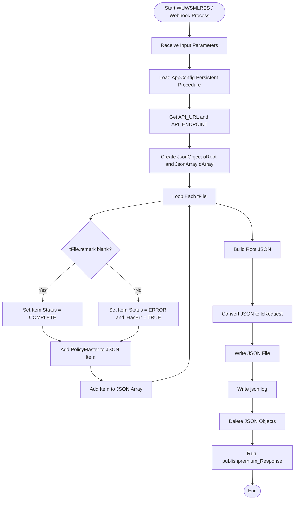
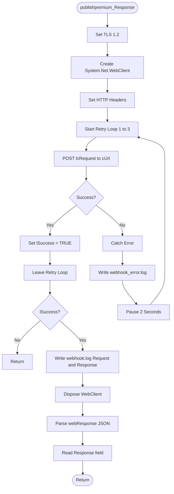
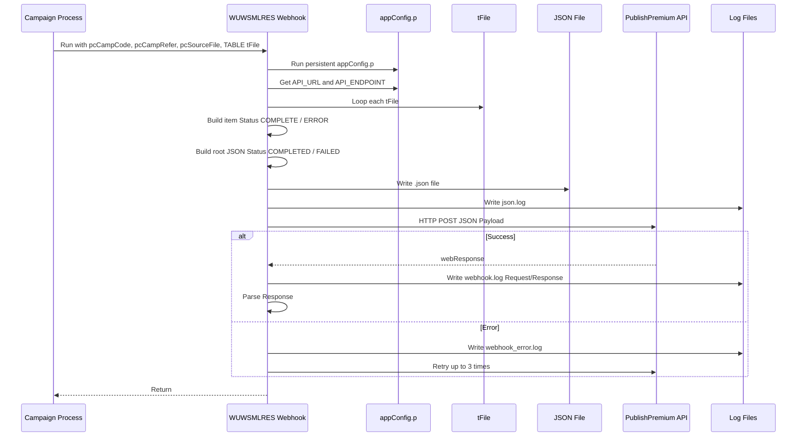
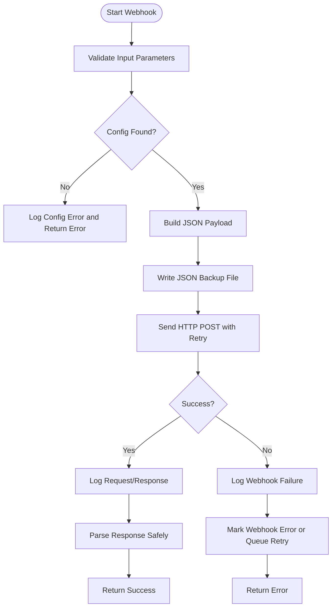

# SmileyQuote Webhook Response to PublishPremium API (WUWSMLRES.p)

**Program:** `WUWSMLRES.p`  
**Process Type:** Webhook / API Callback Process  
**Purpose:** ส่งผลการประมวลผล Campaign Premium กลับไปยัง API `PublishPremium` ของ SmileyQuote  
**Company:** Tokio Marine Safety Insurance (Thailand) Public Company Limited  
**Created By:** Manop G.  
**Document Version:** 1.0  
**Generated Date:** 2026-07-20

---

## 1. Objective

เอกสารนี้อธิบายลำดับการทำงานของโปรแกรม `WUWSMLRES.p` ในส่วนที่ทำหน้าที่ **Send Webhook Back to API PublishPremium SmileyQuote**

โปรแกรมนี้รับข้อมูลจาก Background Process หลักหลังจาก Import / Validate / Upload Campaign File เสร็จแล้ว จากนั้นสร้าง JSON Payload เพื่อส่งกลับไปยัง API Endpoint ที่กำหนดไว้ใน `AppConfig`

โดยผลลัพธ์ที่ส่งกลับจะระบุว่าแต่ละ Policy ทำงานสำเร็จหรือผิดพลาด และสรุปสถานะรวมของ Campaign เป็น `COMPLETED` หรือ `FAILED`

---

## 2. High-Level Summary

โปรแกรมนี้ทำหน้าที่หลักดังนี้

1. รับ Input Parameter จาก Process หลัก
2. โหลดค่า Config สำหรับ API URL และ Endpoint
3. Loop ข้อมูลใน Temp-table `tFile`
4. สร้าง JSON ราย Policy
5. สรุปสถานะรวมของ Campaign
6. เขียน JSON Payload ออกเป็น `.json` file
7. เขียน Log การสร้าง JSON
8. เรียก Procedure สำหรับส่ง Webhook
9. ส่ง HTTP POST ไปยัง API ด้วย JSON Request
10. Retry สูงสุด 3 ครั้ง หากส่งไม่สำเร็จ
11. Log Request และ Response
12. Parse Response ที่ได้รับกลับมา

---

## 3. Input Parameters

โปรแกรมรับ Input Parameter ดังนี้

| Parameter | Type | Description |
|---|---|---|
| `pcCampCode` | Character | Campaign Code หรือ Publish Key ID ที่จะส่งกลับ API |
| `pcCampRefer` | Character | Campaign Reference จากระบบต้นทาง |
| `pcSourceFile` | Character | ชื่อไฟล์ต้นทาง เช่น `.txt` เพื่อใช้สร้างชื่อ `.json` |
| `TABLE FOR tFile` | Temp-table | ข้อมูลผลการ Process ราย Policy |

ตัวอย่างการเรียกจาก Process หลัก:

```progress
RUN WUW\WUWSMLRES (
    INPUT gw_safe.fcamp_fil.CampCode,
          gw_safe.fcamp_fil.Remark5,
          cFile,
    TABLE tFile).
```

---

## 4. Related Components

| Component | Description |
|---|---|
| `WUW\WUWSMLPRM.i` | Include file ที่คาดว่าเก็บ Temp-table `tFile` และตัวแปรร่วม |
| `AppSetting\appConfig.p` | Persistent procedure สำหรับอ่านค่า Config |
| `GetAppConfig` | Function ภายใน `appConfig.p` สำหรับอ่านค่า Config ตาม Key |
| `Progress.Json.ObjectModel.JsonObject` | ใช้สร้าง JSON Object |
| `Progress.Json.ObjectModel.JsonArray` | ใช้สร้าง JSON Array |
| `System.Net.WebClient` | ใช้ส่ง HTTP POST ไปยัง API Endpoint |
| `publishpremium_Response` | Procedure สำหรับส่ง Webhook และรับ Response |

---

## 5. Configuration

โปรแกรม Load ค่า Config ผ่าน Persistent Procedure:

```progress
DEFINE VARIABLE hConfig AS HANDLE NO-UNDO.
RUN AppSetting\appConfig.p PERSISTENT SET hConfig.
```

จากนั้นสร้าง Function สำหรับดึงค่า Config:

```progress
FUNCTION GetConfig RETURNS CHARACTER (INPUT ipKey AS CHARACTER):
    RETURN DYNAMIC-FUNCTION("GetAppConfig" IN hConfig, ipKey).
END FUNCTION.
```

ค่า Config ที่ใช้มีดังนี้

| Config Key | Variable | Description |
|---|---|---|
| `API_URL` | `cApiUrl` | Base URL ของ API |
| `API_ENDPOINT` | `cApiendpoint` | Endpoint สำหรับส่ง Webhook |

ประกอบเป็น Full URL:

```progress
cUrl = cApiUrl + cApiendpoint.
```

ตัวอย่าง:

```text
API_URL      = https://api.example.com
API_ENDPOINT = /publishpremium/response
cUrl         = https://api.example.com/publishpremium/response
```

---

## 6. Overall Process Flow



---

## 7. Main Process Specification

### Step 1: Import Required Classes

โปรแกรมประกาศ `USING` สำหรับใช้งาน .NET HTTP, JSON และ OpenEdge Class ต่าง ๆ

```progress
USING System.Net.Http.*.
USING System.Environment.
USING Progress.Lang.*.
USING Progress.Json.ObjectModel.*.
USING Progress.IO.*.
USING OpenEdge.Net.HTTP.*.
USING OpenEdge.Net.URI.*.
```

> หมายเหตุ: ในโค้ดนี้มี `USING Progress.Json.ObjectModel.*.` ซ้ำ 2 บรรทัด สามารถลบซ้ำออกได้เพื่อความสะอาดของโค้ด

---

### Step 2: Receive Input Parameters

โปรแกรมรับข้อมูลจาก Process ก่อนหน้า ได้แก่ Campaign Code, Campaign Reference, Source File และ Temp-table `tFile`

```progress
DEFINE INPUT PARAMETER pcCampCode  AS CHARACTER NO-UNDO.
DEFINE INPUT PARAMETER pcCampRefer AS CHARACTER NO-UNDO.
DEFINE INPUT PARAMETER pcSourceFile AS CHARACTER NO-UNDO.
DEFINE INPUT PARAMETER TABLE FOR tfile.
```

---

### Step 3: Load API Configuration

โปรแกรมเรียก `AppSetting\appConfig.p` แบบ Persistent:

```progress
RUN AppSetting\appConfig.p PERSISTENT SET hConfig.
```

แล้วอ่าน Config:

```progress
ASSIGN
    cApiUrl      = GetConfig("API_URL")
    cApiendpoint = GetConfig("API_ENDPOINT")
    cUrl         = cApiUrl + cApiendpoint.
```

---

### Step 4: Initialize JSON Object

สร้าง JSON Root และ Array สำหรับเก็บรายการ Policy:

```progress
oRoot   = NEW JsonObject().
oArray  = NEW JsonArray().
lHasErr = FALSE.
```

---

### Step 5: Loop Temp-table `tFile`

โปรแกรม Loop ข้อมูลทุก Record ใน `tFile`

```progress
FOR EACH tfile:
```

สำหรับแต่ละ Record จะสร้าง JSON Item ใหม่:

```progress
oItem = NEW JsonObject().
```

---

### Step 6: Determine Item Status

ถ้า `tFile.remark` ว่าง แปลว่า Policy นั้น Process สำเร็จ:

```progress
IF tfile.remark = "" THEN DO:
    oItem:Add("Status", "COMPLETE").
    oItem:Add("Message", "").
END.
```

ถ้า `tFile.remark` ไม่ว่าง แปลว่ามี Error:

```progress
ELSE DO:
    oItem:Add("Status", "ERROR").
    oItem:Add("Message", TRIM(tFile.remark)).
    lHasErr = TRUE.
END.
```

จากนั้นเพิ่ม Policy Master:

```progress
oItem:Add("PolicyMaster", TRIM(tFile.polmst)).
```

และ Add เข้า Array:

```progress
oArray:Add(oItem).
```

---

## 8. JSON Payload Structure

### 8.1 Root JSON

หลังจาก Loop `tFile` เสร็จ โปรแกรมสร้าง Root JSON ดังนี้

```progress
oRoot:Add("publishKeyID", Int(pcCampCode)).
oRoot:Add("CampaignRefer", TRIM(pcCampRefer)).
oRoot:Add("Status", IF lHasErr THEN "FAILED" ELSE "COMPLETED").
oRoot:Add("items", oArray).
```

### 8.2 JSON Field Description

| JSON Field | Source | Description |
|---|---|---|
| `publishKeyID` | `Int(pcCampCode)` | Publish Key ID / Campaign Code ที่แปลงเป็น Integer |
| `CampaignRefer` | `pcCampRefer` | Campaign Reference |
| `Status` | `lHasErr` | สถานะรวมของ Campaign |
| `items` | `oArray` | รายการผลลัพธ์ราย Policy |
| `items[].Status` | `tFile.remark` | `COMPLETE` หรือ `ERROR` |
| `items[].Message` | `tFile.remark` | Error Message ถ้ามี |
| `items[].PolicyMaster` | `tFile.polmst` | Policy Master |

### 8.3 Example Payload: Success

```json
{
  "publishKeyID": 10001,
  "CampaignRefer": "REF202607001",
  "Status": "COMPLETED",
  "items": [
    {
      "Status": "COMPLETE",
      "Message": "",
      "PolicyMaster": "POL001"
    },
    {
      "Status": "COMPLETE",
      "Message": "",
      "PolicyMaster": "POL002"
    }
  ]
}
```

### 8.4 Example Payload: Failed

```json
{
  "publishKeyID": 10001,
  "CampaignRefer": "REF202607001",
  "Status": "FAILED",
  "items": [
    {
      "Status": "COMPLETE",
      "Message": "",
      "PolicyMaster": "POL001"
    },
    {
      "Status": "ERROR",
      "Message": "Vehicle Usage is not blank",
      "PolicyMaster": "POL002"
    }
  ]
}
```

---

## 9. JSON File Output

โปรแกรมแปลงชื่อไฟล์ต้นทางจาก `.txt` เป็น `.json`

```progress
cJsonFile = REPLACE(pcSourceFile, ".txt", ".json").
oRoot:WriteFile(cJsonFile, TRUE).
```

ตัวอย่าง:

| Source File | JSON File |
|---|---|
| `Campaign_001.txt` | `Campaign_001.json` |

จากนั้นเขียน Log:

```progress
OUTPUT TO "D:\smileyquote\Log\json.log" APPEND.
PUT TODAY FORMAT "99/99/9999" "   " STRING(TIME,"HH:MM:SS")
    " SAVE JSON = " cJsonFile FORMAT "X(200)" SKIP.
OUTPUT CLOSE.
```

---

## 10. Webhook Send Flow: `publishpremium_Response`



---

## 11. Webhook Procedure Specification

### Step 1: Declare Retry Variables

```progress
DEFINE VAR iRetry   AS INT INIT 0.
DEFINE VAR lSuccess AS LOGICAL.
```

`iRetry` ใช้ควบคุมจำนวน Retry ส่วน `lSuccess` ใช้ระบุว่าส่งสำเร็จหรือไม่

---

### Step 2: Enforce TLS 1.2

```progress
System.Net.ServicePointManager:SecurityProtocol = System.Net.SecurityProtocolType:Tls12.
```

กำหนดให้ HTTP Client ใช้ TLS 1.2 สำหรับเชื่อมต่อ API

---

### Step 3: Create WebClient and Set Headers

```progress
HttpClient = NEW System.Net.WebClient().
httpClient:Headers:Remove("Content-Type").
httpClient:headers:ADD("Content-type:application/json;charset=utf-8").
httpClient:Headers:Add("Content-Type", "application/json").
httpClient:Headers:Add("Accept", "application/json").
```

Headers ที่ตั้งค่า:

| Header | Value |
|---|---|
| `Content-Type` | `application/json;charset=utf-8` และ `application/json` |
| `Accept` | `application/json` |

> Technical Note: มีการ Add `Content-Type` ซ้ำ 2 รูปแบบ ควรเหลือเพียงค่าเดียว เช่น `application/json; charset=utf-8`

---

### Step 4: Retry HTTP POST up to 3 Times

```progress
DO iRetry = 1 TO 3:
    DO ON ERROR UNDO, THROW:
        webResponse = httpClient:UploadString(curl, "POST", lcRequest).
        lSuccess = TRUE.
        LEAVE.
        CATCH e AS Progress.Lang.Error:
            ...
        END CATCH.
    END.
END.
```

หากส่งสำเร็จ จะตั้งค่า:

```progress
lSuccess = TRUE.
```

แล้วออกจาก Retry Loop

หากเกิด Error จะเข้า `CATCH` เพื่อเขียน Log และ `PAUSE 2` วินาทีก่อน Retry รอบถัดไป

---

### Step 5: Write Error Log on Exception

ถ้าเกิด Error ระหว่างส่ง HTTP Request จะเขียน Log ที่:

```text
D:\smileyquote\log\webhook_error.log
```

รูปแบบ Log:

```text
20/07/2026 13:56:00 ERROR (Retry 1): <error message>
```

---

### Step 6: Return if All Retries Failed

ถ้าส่งไม่สำเร็จหลัง Retry ครบ 3 ครั้ง:

```progress
IF NOT lSuccess THEN DO:
    RETURN.
END.
```

> ในโค้ดปัจจุบันยังไม่มีการ Mark Fail กลับไปที่ Control Table หรือ Update Status กรณี Webhook ล้มเหลว ควรพิจารณาเพิ่ม Error Handling ส่วนนี้

---

### Step 7: Log Request and Response

เมื่อส่งสำเร็จ จะเขียน Request และ Response ลงไฟล์:

```text
D:\smileyquote\log\webhook.log
```

ข้อมูลที่ Log:

1. Date / Time
2. Request JSON
3. Response JSON หรือ Response Text จาก API

---

### Step 8: Dispose HTTP Client

หลังใช้งานเสร็จ มีการ Clean Object:

```progress
HttpClient:Dispose().
DELETE OBJECT HttpClient.
```

---

### Step 9: Parse API Response

หลังได้ `webResponse` กลับมา โปรแกรม Parse เป็น JSON:

```progress
myParser = NEW ObjectModelParser().
ojson = CAST(myParser:Parse((webResponse)),JsonObject) NO-ERROR.
oResponse = string(ojson:GetJsonText("Response")) NO-ERROR.
```

---

## 12. Sequence Diagram



---

## 13. Status Logic

### 13.1 Item-Level Status

| Condition | Item Status | Message |
|---|---|---|
| `tFile.remark = ""` | `COMPLETE` | Blank |
| `tFile.remark <> ""` | `ERROR` | `TRIM(tFile.remark)` |

### 13.2 Root-Level Status

| Condition | Root Status |
|---|---|
| ไม่มีรายการ Error | `COMPLETED` |
| มีอย่างน้อย 1 รายการ Error | `FAILED` |

Logic:

```progress
oRoot:Add("Status", IF lHasErr THEN "FAILED" ELSE "COMPLETED").
```

---

## 14. Log Files

| File | Purpose |
|---|---|
| `D:\smileyquote\Log\json.log` | บันทึกว่า Save JSON File แล้ว |
| `D:\smileyquote\log\webhook.log` | บันทึก Request และ Response เมื่อส่ง API สำเร็จ |
| `D:\smileyquote\log\webhook_error.log` | บันทึก Error กรณีส่ง API ไม่สำเร็จในแต่ละ Retry |

---

## 15. Technical Findings / Recommendations

### 15.1 Variable Name Case: `cUrl` vs `curl`

ในโค้ดกำหนดตัวแปร:

```progress
DEFINE VARIABLE cUrl AS LONGCHAR NO-UNDO.
```

แต่ตอนส่ง HTTP ใช้:

```progress
webResponse = httpClient:UploadString(curl, "POST", lcRequest).
```

OpenEdge ABL โดยทั่วไปไม่สนใจตัวพิมพ์เล็ก/ใหญ่ของชื่อตัวแปร แต่เพื่อความอ่านง่ายและลดความสับสน ควรใช้ชื่อเดียวกันให้สม่ำเสมอ เช่น `cUrl`

Recommended:

```progress
webResponse = httpClient:UploadString(cUrl, "POST", lcRequest).
```

---

### 15.2 `publishKeyID` Converts `pcCampCode` to Integer

Current code:

```progress
oRoot:Add("publishKeyID", Int(pcCampCode)).
```

หาก `pcCampCode` ไม่ใช่ตัวเลข จะเกิด Error ได้ เช่น `CMP001`

Recommended:

```progress
DEFINE VARIABLE iPublishKeyID AS INTEGER NO-UNDO.

iPublishKeyID = INTEGER(pcCampCode) NO-ERROR.
IF ERROR-STATUS:ERROR THEN DO:
    /* log invalid publish key id */
END.
ELSE DO:
    oRoot:Add("publishKeyID", iPublishKeyID).
END.
```

หรือถ้า API รองรับ String ควรส่งเป็น String:

```progress
oRoot:Add("publishKeyID", TRIM(pcCampCode)).
```

---

### 15.3 Duplicate `Content-Type` Header

Current code Add `Content-Type` มากกว่า 1 ครั้ง:

```progress
httpClient:headers:ADD("Content-type:application/json;charset=utf-8").
httpClient:Headers:Add("Content-Type", "application/json").
```

ควรเหลือเพียงค่าเดียว:

```progress
httpClient:Headers:Add("Content-Type", "application/json; charset=utf-8").
httpClient:Headers:Add("Accept", "application/json").
```

---

### 15.4 JSON Object Cleanup Too Early

โปรแกรมลบ `oRoot` และ `oArray` ก่อนเรียก `publishpremium_Response`

```progress
DELETE OBJECT oRoot.
DELETE OBJECT oArray.
RUN publishpremium_Response.
```

กรณีนี้ยังใช้งานได้ เพราะ `lcRequest` ถูกสร้างไว้แล้ว แต่ควรระวังว่า Procedure ถัดไปใช้ได้เฉพาะ `lcRequest` เท่านั้น ไม่สามารถกลับไปอ่าน `oRoot` ได้แล้ว

---

### 15.5 `oItem` Not Explicitly Deleted

ใน Loop มีการสร้าง `oItem = NEW JsonObject()` หลายครั้ง แต่ไม่ได้ `DELETE OBJECT oItem`

เนื่องจาก Add เข้า `oArray` แล้ว Object ยังถูกถือ Reference อยู่โดย Array จึงไม่ควรลบทันทีระหว่าง Loop แต่หลัง `DELETE OBJECT oRoot` และ `oArray` ควรตรวจสอบ Memory Behavior เพิ่มเติมหาก Batch มีจำนวน Record มาก

---

### 15.6 Missing Persistent Procedure Cleanup

มีการ Run Persistent:

```progress
RUN AppSetting\appConfig.p PERSISTENT SET hConfig.
```

แต่ไม่พบการ Delete Procedure Handle หลังใช้งาน

Recommended:

```progress
IF VALID-HANDLE(hConfig) THEN
    DELETE PROCEDURE hConfig.
```

---

### 15.7 Retry Failure Not Reflected to Main Process

หากส่ง Webhook ไม่สำเร็จครบ 3 ครั้ง โปรแกรมทำเพียง:

```progress
IF NOT lSuccess THEN DO:
    RETURN.
END.
```

ควรพิจารณาเพิ่มกลไกแจ้ง Main Process หรือ Update Status เช่น:

- Update `fcamp_fil.Remark3 = STATUS=WEBHOOK_ERROR`
- เขียน Retry Queue
- เก็บ Request JSON เพื่อส่งซ้ำภายหลัง
- Return Error กลับไปยัง Caller

---

### 15.8 Response Parsing Should Check Object Availability

Current code:

```progress
ojson = CAST(myParser:Parse((webResponse)),JsonObject) NO-ERROR.
oResponse = string(ojson:GetJsonText("Response")) NO-ERROR.
```

ถ้า Response ไม่ใช่ JSON หรือ Parse ไม่สำเร็จ `ojson` อาจเป็น Unknown / Invalid ได้

Recommended:

```progress
ojson = CAST(myParser:Parse(webResponse), JsonObject) NO-ERROR.
IF VALID-OBJECT(ojson) THEN DO:
    oResponse = STRING(ojson:GetJsonText("Response")) NO-ERROR.
END.
ELSE DO:
    /* log invalid response format */
END.
```

---

## 16. Recommended Improved Process Flow



---

## 17. End-to-End Process Numbered Steps

1. Main Campaign Process เรียก Webhook Program พร้อม `pcCampCode`, `pcCampRefer`, `pcSourceFile` และ `TABLE tFile`
2. Webhook Program Include `WUW\WUWSMLPRM.i` เพื่อรู้โครงสร้าง `tFile`
3. Program เรียก `AppSetting\appConfig.p` แบบ Persistent
4. Program สร้าง Function `GetConfig` เพื่ออ่านค่า Config
5. Program อ่าน `API_URL`
6. Program อ่าน `API_ENDPOINT`
7. Program ประกอบ `cUrl = API_URL + API_ENDPOINT`
8. Program สร้าง `oRoot` เป็น JSON Object หลัก
9. Program สร้าง `oArray` เป็น JSON Array สำหรับรายการ Policy
10. Program กำหนด `lHasErr = FALSE`
11. Program Loop ข้อมูลทุก Record ใน `tFile`
12. สำหรับแต่ละ `tFile` Program สร้าง `oItem` เป็น JSON Object
13. ถ้า `tFile.remark = ""` ให้กำหนด Item Status เป็น `COMPLETE`
14. ถ้า `tFile.remark <> ""` ให้กำหนด Item Status เป็น `ERROR`
15. กรณี Error ให้ใส่ `Message = tFile.remark`
16. กรณี Error ให้ Set `lHasErr = TRUE`
17. Program เพิ่ม `PolicyMaster = tFile.polmst` เข้า `oItem`
18. Program Add `oItem` เข้า `oArray`
19. เมื่อ Loop ครบ Program เพิ่ม `publishKeyID` เข้า Root JSON
20. Program เพิ่ม `CampaignRefer` เข้า Root JSON
21. Program กำหนด Root Status เป็น `FAILED` ถ้ามี Error อย่างน้อย 1 รายการ
22. Program กำหนด Root Status เป็น `COMPLETED` ถ้าไม่มี Error
23. Program เพิ่ม `items = oArray` เข้า Root JSON
24. Program แปลง JSON Root เป็น String ลง `lcRequest`
25. Program สร้างชื่อ JSON File จาก `pcSourceFile` โดยเปลี่ยน `.txt` เป็น `.json`
26. Program เขียน JSON Payload ลง File ด้วย `oRoot:WriteFile`
27. Program เขียน Log ลง `D:\smileyquote\Log\json.log`
28. Program Delete JSON Object หลัก
29. Program เรียก Procedure `publishpremium_Response`
30. Procedure กำหนด Security Protocol เป็น TLS 1.2
31. Procedure สร้าง `System.Net.WebClient`
32. Procedure ตั้งค่า HTTP Header เป็น JSON
33. Procedure เริ่ม Retry Loop จำนวน 3 ครั้ง
34. Procedure เรียก `UploadString(cUrl, "POST", lcRequest)` เพื่อส่ง JSON ไป API
35. ถ้าส่งสำเร็จ ให้ Set `lSuccess = TRUE` และออกจาก Loop
36. ถ้าส่งไม่สำเร็จ ให้ Catch Error
37. Procedure เขียน Error ลง `webhook_error.log`
38. Procedure Pause 2 วินาทีก่อน Retry รอบถัดไป
39. ถ้า Retry ครบแล้วยังไม่สำเร็จ Procedure จะ `RETURN`
40. ถ้าส่งสำเร็จ Procedure เขียน Request และ Response ลง `webhook.log`
41. Procedure Dispose และ Delete `HttpClient`
42. Procedure Parse `webResponse` เป็น JSON
43. Procedure อ่านค่า Field `Response` จาก JSON Response
44. Procedure Return กลับไป Main Program
45. Main Program จบการทำงานของ Webhook Process

---

## 18. Business Summary

Webhook Process นี้เป็นขั้นตอนสุดท้ายของ Campaign File Processing โดยทำหน้าที่แจ้งผลกลับไปยัง API ของ SmileyQuote ว่า Campaign PublishPremium ที่ส่งมา มี Policy ใดสำเร็จหรือผิดพลาดบ้าง

ถ้าทุก Policy สำเร็จ Root Status จะเป็น:

```text
COMPLETED
```

ถ้ามี Policy ใดผิดพลาดอย่างน้อย 1 รายการ Root Status จะเป็น:

```text
FAILED
```

ระบบจะเก็บ JSON Payload เป็นไฟล์ `.json` และส่ง HTTP POST กลับไปยัง API Endpoint ที่กำหนดใน AppConfig พร้อมบันทึก Request / Response และ Error Log เพื่อใช้ตรวจสอบย้อนหลัง

---

## 19. Suggested Next Step

สามารถต่อยอดเอกสารนี้เป็นเอกสารเพิ่มเติมได้ เช่น:

1. **API Contract Specification** สำหรับ Webhook Payload
2. **SIT Test Case** สำหรับทดสอบ Webhook Success / Failed / Retry
3. **Error Handling Specification** สำหรับ Webhook Failure
4. **Retry Queue Design** สำหรับส่ง Webhook ซ้ำกรณี API ปลายทางล่ม
5. **Data Mapping Specification** ระหว่าง `tFile` กับ JSON Payload
