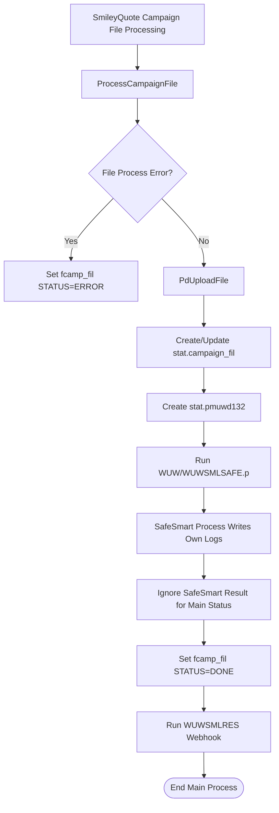
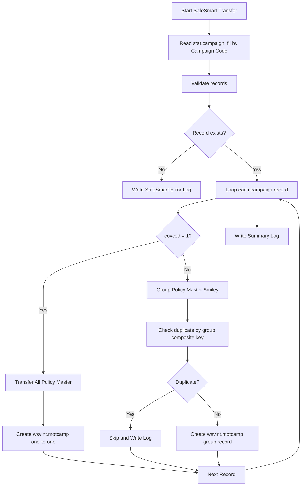
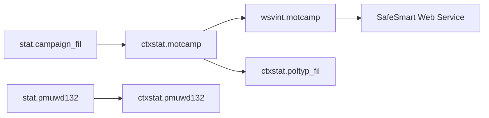
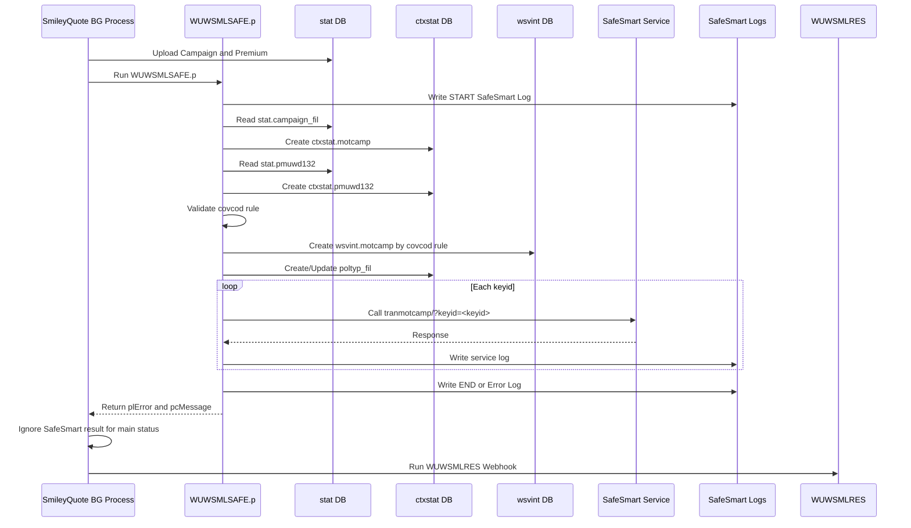

# New SafeSmart Transfer Program

**Program Name:** `WUW\WUWSMLSAFE.p`  
**Process Name:** Transfer Campaign to Safe Smart  
**Process Type:** Background / Batch Sub Process  
**Main Caller:** SmileyQuote Campaign File Processing  
**Purpose:** ตัดระบบ GUI ออกจากโปรแกรม Transfer Campaign To Safe Smart เดิม แล้วนำ Logic ไปใช้ต่อแบบ Background หลังจาก SmileyQuote Campaign File Processing Upload Campaign สำเร็จ  
**Important Principle:** SafeSmart Process ต้องจบเฉพาะระบบ SafeSmart และเขียน Log เฉพาะ SafeSmart เท่านั้น ไม่กระทบ Main Status ของ SmileyQuote Campaign Processing  
**Document Version:** 1.0  
**Generated Date:** 2026-07-20

---

## 1. สรุปผล Transfer Campaign to Safe Smart

โปรแกรมตัวใหม่ `WUW\WUWSMLSAFE.p` ถูกออกแบบเพื่อแทนที่การกดปุ่มบน GUI เดิมของ **Transfer Campaign To Safe Smart [Motor / Campaign]** โดยทำงานแบบ Background ต่อจาก SmileyQuote Campaign File Processing

### เป้าหมายหลัก

1. รับ Campaign Code จาก Background Process
2. นำข้อมูล Campaign ที่สร้างไว้ใน `stat.campaign_fil` ไปสร้างข้อมูลสำหรับ SafeSmart
3. Copy Premium Detail จาก `stat.pmuwd132` ไป `ctxstat.pmuwd132`
4. Transfer ข้อมูลจาก `ctxstat.motcamp` ไป `wsvint.motcamp`
5. Auto Set Parameter Campaign ที่ `ctxstat.poltyp_fil`
6. Call SafeSmart Web Service ด้วย `keyid`
7. เขียน Log เฉพาะระบบ SafeSmart
8. ไม่ทำให้ SmileyQuote Main Process เป็น Error หาก SafeSmart ล้มเหลว

---

## 2. Scope ของโปรแกรมใหม่

### In Scope

| Scope | Description |
|---|---|
| Remove GUI | ตัดปุ่ม, Frame, Message, Display, Radio-set ออกจากโปรแกรมเดิม |
| Batch Process | เปลี่ยนเป็น Sub Program ที่รับ Input Parameter |
| SafeSmart Log Only | Log ทั้งหมดเขียนแยกที่ Path ของ SafeSmart |
| Auto Group Policy | แยก Transfer Mode ตาม `campaign_fil.covcod` |
| Web Service Call | เรียก SafeSmart URL ด้วย `keyid` |
| Non-block Main Status | SafeSmart Error ไม่เปลี่ยนสถานะหลักของ SmileyQuote |

### Out of Scope

| Out of Scope | Description |
|---|---|
| GUI Manual Operation | ไม่ใช้หน้าจอเดิมในการกด OK / Transfer Safe Smart |
| SmileyQuote Webhook Failure | SafeSmart Error ไม่ทำให้ Webhook SmileyQuote เป็น `FAILED` |
| Main fcamp_fil Error | SafeSmart Error ไม่เปลี่ยน `fcamp_fil.Remark3` เป็น `STATUS=ERROR` |

---

## 3. Integration Point กับ SmileyQuote Campaign File Processing

### Flow เดิม

```text
SmileyQuote API
  -> WUWSMLCAM
  -> Background Process
  -> ProcessCampaignFile
  -> PdUploadFile
  -> Create stat.campaign_fil
  -> Create stat.pmuwd132
  -> WUWSMLRES Webhook
```

### Flow ใหม่หลังเพิ่ม SafeSmart

```text
SmileyQuote API
  -> WUWSMLCAM
  -> Background Process
  -> ProcessCampaignFile
  -> PdUploadFile
  -> Create stat.campaign_fil
  -> Create stat.pmuwd132
  -> WUWSMLSAFE.p
  -> WUWSMLRES Webhook
```

> SafeSmart เป็น Optional / Independent Sub Process: หาก SafeSmart Error ให้จบที่ SafeSmart Log เท่านั้น

---

## 4. High-Level Flow Diagram



---

## 5. Program Interface

### Program

```text
WUW\WUWSMLSAFE.p
```

### Input Parameters

| Parameter | Type | Description |
|---|---|---|
| `pcCampCode` | CHARACTER | Campaign Code ที่ต้องการ Transfer ไป SafeSmart |
| `pcCampaignType` | CHARACTER | ประเภท Campaign เช่น `C` = Center, `S` = Special |
| `pcGroupPolicy` | CHARACTER | แนะนำใช้ `AUTO` เพื่อให้ระบบแยกตาม `covcod` |
| `pcEnv` | CHARACTER | Environment เช่น `UAT` หรือ `PROD` |

### Output Parameters

| Parameter | Type | Description |
|---|---|---|
| `plError` | LOGICAL | สถานะ Error ของ SafeSmart Process |
| `pcMessage` | LONGCHAR | Message ของ SafeSmart Process |

### ตัวอย่างการเรียกจาก Background Process

```progress
RUN WUW\WUWSMLSAFE.p (
    INPUT  gw_safe.fcamp_fil.CampCode,
    INPUT  "C",
    INPUT  "AUTO",
    INPUT  "UAT",
    OUTPUT lSafeSmartError,
    OUTPUT cSafeSmartMsg
) NO-ERROR.
```

> Main Process ไม่ควรนำ `lSafeSmartError` ไป Set `fcamp_fil.Remark3 = STATUS=ERROR` และไม่ควร Set `tFile.remark`

---

## 6. Process Summary แบบเรียงลำดับทีละข้อ

1. SmileyQuote Campaign File Processing ทำงานจน Upload Campaign สำเร็จ
2. ระบบสร้าง/อัปเดตข้อมูลใน `stat.campaign_fil`
3. ระบบสร้าง Premium Detail ใน `stat.pmuwd132`
4. Background Process เรียก `WUW\WUWSMLSAFE.p`
5. `WUWSMLSAFE.p` เริ่มต้น SafeSmart Process
6. ระบบสร้าง Log Folder เฉพาะ SafeSmart หากยังไม่มี
7. ระบบเขียน Start Log ของ SafeSmart
8. ระบบ Normalize Campaign Code เพื่อลบ `/`, `-`, `+`, `_` สำหรับใช้สร้าง `keyid`
9. ระบบ Generate Date Key ตาม Logic เดิมของ SafeSmart
10. ระบบคัดลอกข้อมูลจาก `stat.campaign_fil` ไป `ctxstat.motcamp`
11. ระบบ Generate `keyid` ให้แต่ละ Record
12. ระบบ Lookup ข้อมูล Vehicle Use Description จาก `sicsyac.xtu001`
13. ระบบ Lookup ข้อมูล CCTV Description จาก `xcpara49`
14. ระบบ Copy Premium Detail จาก `stat.pmuwd132` ไป `ctxstat.pmuwd132`
15. ระบบ Validate จำนวน Record และแยกประเภท Transfer ตาม `campaign_fil.covcod`
16. ถ้า `covcod = "1"` ให้ถือเป็น `Transfer All Policy Master`
17. ถ้า `covcod <> "1"` ให้ถือเป็น `Group Policy Master (Smiley)`
18. ระบบ Transfer ข้อมูลจาก `ctxstat.motcamp` ไป `wsvint.motcamp` ตาม Rule ของแต่ละ Record
19. ระบบ Auto Set Campaign Parameter ที่ `ctxstat.poltyp_fil`
20. ระบบ Loop เรียก SafeSmart Web Service ด้วย `keyid`
21. ระบบเขียน Service Request / Response ลง SafeSmart Service Log
22. หากเกิด Error ให้เขียนเฉพาะ SafeSmart Error Log
23. ระบบเขียน End Log ของ SafeSmart
24. Control กลับไป Main Background Process
25. Main Background Process ทำงานต่อและ Set `fcamp_fil = STATUS=DONE`
26. Main Background Process เรียก `WUWSMLRES` เพื่อ Webhook กลับ SmileyQuote

---

## 7. SafeSmart Transfer Mode Rule

Requirement ใหม่กำหนดให้แยก Transfer Mode ตามระดับ Record จาก `campaign_fil.covcod`

| Condition | Transfer Mode | Description |
|---|---|---|
| `campaign_fil.covcod = "1"` | `Transfer All Policy Master` | Transfer แบบ All Policy Master |
| `campaign_fil.covcod <> "1"` | `Group Policy Master (Smiley)` | Transfer แบบ Group Policy Master |

### Important Note

Campaign เดียวกันสามารถมี Record ผสมกันได้ เช่น:

```text
Policy A: covcod = 1    -> Transfer All Policy Master
Policy B: covcod = 2.1  -> Group Policy Master (Smiley)
Policy C: covcod = 3.2  -> Group Policy Master (Smiley)
```

ดังนั้น Logic ต้องทำงาน **ราย Record** ไม่ใช่ตัดสินทั้ง Campaign จากค่าเดียว

---

## 8. SafeSmart Group Policy Flow



---

## 9. Key Procedures in New Program

| Procedure | Purpose |
|---|---|
| `NormalizeCampaignCode` | ลบอักขระพิเศษจาก Campaign Code เพื่อสร้าง `keyid` |
| `GenerateDateKey` | สร้าง Date Key ตาม Logic เดิม |
| `PDTransMotCamp` | Copy `stat.campaign_fil` ไป `ctxstat.motcamp` |
| `PDpmuwd132` | Copy `stat.pmuwd132` ไป `ctxstat.pmuwd132` |
| `ValidateSafeSmartGroupPolicy` | ตรวจและนับจำนวน Record แยกตาม `covcod` |
| `PDTransWsvintByCovcodRule` | Transfer ไป `wsvint.motcamp` ตาม Rule `covcod` |
| `PDSetCampaign` | Auto Set `ctxstat.poltyp_fil` |
| `ExecuteSafeSmartService` | Loop ยิง SafeSmart Service ตามจำนวน `keyid` |
| `PDTransSafeSmart` | Call SafeSmart Web Service |
| `WriteSafeSmartLog` | เขียน Main SafeSmart Log |
| `WriteSafeSmartErrorLog` | เขียน Error Log เฉพาะ SafeSmart |
| `WriteSafeSmartServiceLog` | เขียน Service Request / Response Log |

---

## 10. Data Movement Summary



### Source and Target

| Source | Target | Procedure |
|---|---|---|
| `stat.campaign_fil` | `ctxstat.motcamp` | `PDTransMotCamp` |
| `stat.pmuwd132` | `ctxstat.pmuwd132` | `PDpmuwd132` |
| `ctxstat.motcamp` | `wsvint.motcamp` | `PDTransWsvintByCovcodRule` |
| `ctxstat.motcamp` | SafeSmart Service | Via `keyid` |
| Generated Parameter | `ctxstat.poltyp_fil` | `PDSetCampaign` |

---

## 11. SafeSmart Log Specification

SafeSmart ต้องเขียน Log แยกจาก Main SmileyQuote Process

### Log Folder

```text
D:\smileyquote\Log\SafeSmart\
```

### Log Files

| Log File | Purpose |
|---|---|
| `SafeSmart_Transfer_YYYYMMDD.log` | Main Process Log เช่น Start, End, Count |
| `SafeSmart_Error_YYYYMMDD.log` | Error Log เฉพาะ SafeSmart |
| `SafeSmart_Service_YYYYMMDD.log` | Request / Response จาก SafeSmart Service |

### Example Main Log

```text
20/07/2026 16:40:01 : START SafeSmart Transfer CampCode=CMP001
20/07/2026 16:40:02 : SafeSmart Validate Group Policy CampCode=CMP001 AllPolicyCount=10 GroupPolicyCount=5
20/07/2026 16:40:03 : PDTransWsvintByCovcodRule completed CampCode=CMP001 TransferAllCount=10 TransferGroupCount=5
20/07/2026 16:40:05 : END SafeSmart Transfer SUCCESS CampCode=CMP001
```

### Example Service Log

```text
20/07/2026 16:40:04 : REQUEST keyid=CMP001202620071 URL=http://10.35.1.155:8080/styweb-online-test/tranmotcamp/?keyid=CMP001202620071
20/07/2026 16:40:05 : SUCCESS keyid=CMP001202620071 Retry=1 Response=Success
```

### Example Error Log

```text
20/07/2026 16:40:05 : ERROR : SafeSmart Web Service failed keyid=CMP001202620071
```

---

## 12. End-to-End Sequence Diagram



---

## 13. Main Background Program Update

หลัง `PdUploadFile` สำเร็จ ให้เรียก SafeSmart แต่ไม่ผูกผลกับ Main Status

```progress
DEFINE VARIABLE lSafeSmartError AS LOGICAL  NO-UNDO.
DEFINE VARIABLE cSafeSmartMsg   AS LONGCHAR NO-UNDO.

RUN WUW\WUWSMLSAFE.p (
    INPUT  gw_safe.fcamp_fil.CampCode,
    INPUT  "C",
    INPUT  "AUTO",
    INPUT  "UAT",
    OUTPUT lSafeSmartError,
    OUTPUT cSafeSmartMsg
) NO-ERROR.

/* SafeSmart result is logged only in SafeSmart log files.
   Do not set fcamp_fil Remark3 to ERROR.
   Do not set tFile.remark. */

gw_safe.fcamp_fil.Remark3 = "STATUS=DONE".
```

---

## 14. Core Pseudo Code for New SafeSmart Program

```progress
DO ON ERROR UNDO, THROW:

    RUN EnsureSafeSmartLogFolder.
    RUN WriteSafeSmartLog(INPUT "START SafeSmart Transfer CampCode=" + pcCampCode).

    RUN NormalizeCampaignCode.
    RUN GenerateDateKey.

    RUN PDTransMotCamp.
    IF plError THEN RETURN.

    RUN PDpmuwd132.
    IF plError THEN RETURN.

    RUN ValidateSafeSmartGroupPolicy.
    IF plError THEN RETURN.

    RUN PDTransWsvintByCovcodRule.
    IF plError THEN RETURN.

    RUN PDSetCampaign.
    IF plError THEN RETURN.

    RUN ExecuteSafeSmartService.
    IF plError THEN RETURN.

    RUN WriteSafeSmartLog(INPUT "END SafeSmart Transfer SUCCESS CampCode=" + pcCampCode).

END.

CATCH e AS Progress.Lang.Error:
    ASSIGN
        plError = TRUE
        pcMessage = e:GetMessage(1).

    RUN WriteSafeSmartErrorLog(INPUT "EXCEPTION CampCode=" + pcCampCode + " Message=" + pcMessage).
END CATCH.
```

---

## 15. Core Pseudo Code: Transfer by `covcod` Rule

```progress
FOR EACH ctxstat.motcamp
    WHERE ctxstat.motcamp.camcod = pcCampCode NO-LOCK:

    IF TRIM(ctxstat.motcamp.covcod) = "1" THEN DO:
        /* Transfer All Policy Master */
        CREATE wsvint.motcamp.
        RUN AssignWsvintFromCtxstat.
    END.
    ELSE DO:
        /* Group Policy Master (Smiley) */
        FIND FIRST wsvint.motcamp
            WHERE wsvint.motcamp.camcod = ctxstat.motcamp.camcod
              AND wsvint.motcamp.sclass = ctxstat.motcamp.sclass
              AND wsvint.motcamp.makeyr = ctxstat.motcamp.makeyr
              AND wsvint.motcamp.simin  = ctxstat.motcamp.simin
              AND wsvint.motcamp.simax  = ctxstat.motcamp.simax
              AND wsvint.motcamp.mincst = ctxstat.motcamp.mincst
              AND wsvint.motcamp.maxcst = ctxstat.motcamp.maxcst
            NO-ERROR.

        IF NOT AVAILABLE wsvint.motcamp THEN DO:
            CREATE wsvint.motcamp.
            RUN AssignWsvintFromCtxstat.
            ASSIGN
                wsvint.motcamp.makedes  = ""
                wsvint.motcamp.modeldes = "".
        END.
    END.

END.
```

---

## 16. Success Criteria

| Criteria | Expected Result |
|---|---|
| Campaign Upload สำเร็จ | มีข้อมูลใน `stat.campaign_fil` และ `stat.pmuwd132` |
| SafeSmart Process เริ่ม | มี Start Log ใน `SafeSmart_Transfer_YYYYMMDD.log` |
| Copy to `ctxstat.motcamp` สำเร็จ | มีข้อมูลตาม `pcCampCode` |
| Copy to `ctxstat.pmuwd132` สำเร็จ | มี Premium Detail ตาม `pcCampCode` |
| Transfer by `covcod` Rule | `covcod=1` เป็น All, อื่น ๆ เป็น Group |
| Copy to `wsvint.motcamp` สำเร็จ | มีข้อมูลตาม Transfer Mode |
| SafeSmart Service Success | มี Response ใน `SafeSmart_Service_YYYYMMDD.log` |
| SafeSmart Error | มี Error เฉพาะใน `SafeSmart_Error_YYYYMMDD.log` |
| Main SmileyQuote Status | ยังคง `STATUS=DONE` ถ้า Campaign Upload สำเร็จ |

---

## 17. Key Technical Notes

1. `SafeSmart` ต้องไม่ใช้ `MESSAGE`, `DISP`, `FRAME`, `BUTTON`, `RADIO-SET`
2. `SafeSmart` ต้องเขียน Log เฉพาะที่ `D:\smileyquote\Log\SafeSmart\`
3. `SafeSmart` Error ไม่ควรแก้ `tFile.remark`
4. `SafeSmart` Error ไม่ควรแก้ `fcamp_fil.Remark3`
5. `covcod` ต้อง Trim ก่อน Compare
6. `covcod = "1"` เท่านั้นที่เป็น All Policy Master
7. `covcod <> "1"` ทุกกรณีเป็น Group Policy Master
8. ถ้า Campaign มีทั้ง All และ Group ในชุดเดียว ต้อง Transfer แยกราย Record
9. ควรย้าย SafeSmart URL ไป Config ใน Phase ถัดไป
10. ควรเพิ่ม Retry สำหรับ Web Service อย่างน้อย 3 ครั้ง

---

## 18. Recommended Implementation Phases

### Phase 1: Create New Program

สร้างไฟล์ใหม่:

```text
WUW\WUWSMLSAFE.p
```

### Phase 2: Move Logic from GUI

ย้าย Logic จาก GUI เดิมเฉพาะ Procedure หลัก:

- `PDTransMotCamp`
- `PDpmuwd132`
- `PDSetCampaign`
- `PDTransSafeSmart`

### Phase 3: Replace Manual Group Policy

เพิ่ม Procedure ใหม่:

- `ValidateSafeSmartGroupPolicy`
- `PDTransWsvintByCovcodRule`

### Phase 4: Add SafeSmart Log Only

เพิ่ม Log Helper:

- `WriteSafeSmartLog`
- `WriteSafeSmartErrorLog`
- `WriteSafeSmartServiceLog`

### Phase 5: Integrate with Background Process

เรียก `WUWSMLSAFE.p` หลัง `PdUploadFile` สำเร็จ โดยไม่กระทบ Main Status

---

## 19. Business Summary

โปรแกรมใหม่ `WUW\WUWSMLSAFE.p` จะเป็น Batch Sub Process สำหรับส่ง Campaign ไป SafeSmart โดยไม่ต้องใช้ GUI เดิม และทำงานต่อจาก SmileyQuote Campaign File Processing โดยอัตโนมัติ

ระบบจะ Transfer ข้อมูลตาม Rule ใหม่:

```text
campaign_fil.covcod = 1    => Transfer All Policy Master
campaign_fil.covcod <> 1   => Group Policy Master (Smiley)
```

SafeSmart Process จะจบที่ระบบ SafeSmart เอง และเก็บผลการทำงานไว้ใน Log เฉพาะ SafeSmart เท่านั้น เพื่อไม่ให้ Error ของ SafeSmart ไปกระทบสถานะหลักของ SmileyQuote Campaign Processing หรือ Webhook ผลลัพธ์กลับ SmileyQuote
