# Transfer Campaign to Safe Smart - OpenEdge GUI Program

**Program Context:** Transfer Campaign To Safe Smart `[Motor / Campaign] (UAT)`  
**Process Type:** OpenEdge GUI / Manual Transfer / Campaign Publishing to Safe Smart  
**Main Purpose:** นำข้อมูล Campaign จาก `stat.campaign_fil` ไปสร้างข้อมูลที่ `ctxstat.motcamp`, export CSV, copy premium detail จาก `stat.pmuwd132` ไป `ctxstat.pmuwd132`, transfer ข้อมูลไป `wsvint.motcamp`, auto set campaign parameter และเรียก Web Service Safe Smart ด้วย `keyid`  
**Document Version:** 1.0  
**Generated Date:** 2026-07-20

---

## 1. Objective

เอกสารนี้วิเคราะห์โค้ด OpenEdge GUI Program สำหรับ **Transfer Campaign To Safe Smart** โดยโปรแกรมมีหน้าจอให้ User ระบุ Campaign No. แล้วกดปุ่มทำงานตามลำดับ เช่น Upload จาก `stat` ไป `ctxstat`, Export CSV, Copy Premium Detail และ Transfer ไป Safe Smart ผ่าน Web Service

โปรแกรมนี้มี 2 ส่วนหลัก:

1. **เตรียมข้อมูล Campaign ในฝั่ง `ctxstat`**
   - ดึงข้อมูลจาก `stat.campaign_fil`
   - สร้างข้อมูลใน `ctxstat.motcamp`
   - Copy Premium Detail จาก `stat.pmuwd132` ไป `ctxstat.pmuwd132`
   - Export ข้อมูล Campaign เป็น CSV

2. **Transfer Campaign ขึ้น Safe Smart**
   - Copy ข้อมูลจาก `ctxstat.motcamp` ไป `wsvint.motcamp`
   - Auto Set Parameter Campaign ที่ `ctxstat.poltyp_fil`
   - Generate `keyid`
   - Call Web Service Safe Smart ผ่าน URL `tranmotcamp/?keyid=`

---

## 2. Main UI Components

| UI Control | Label | Purpose |
|---|---|---|
| `fi_camp` | Campaign No. | ระบุ Campaign Code ที่ต้องการ Transfer |
| `fi_output` | Output File | ระบุ Path สำหรับ Export CSV |
| `ra_campaigntype` | แคมเปญกลาง / แคมเปญพิเศษ | กำหนดประเภท Campaign เป็น `C` หรือ `S` |
| `ra_grouppolicy` | Transfer All Policy Master / Group Policy Master | เลือก mode การ Transfer ไป `wsvint.motcamp` |
| `buok` | OK | เริ่มสร้างข้อมูลใน `ctxstat` และ Export |
| `nv_trans_safe` | Transfer Safe Smart | Transfer ข้อมูลไป Safe Smart |
| `budel` | DEL | ลบ Campaign ที่เคย Transfer ใน `ctxstat` |
| `nv_clear` | Clear | Reset ค่าในหน้าจอ |
| `buexit` | EXIT | ปิดหน้าจอ |

---

## 3. Related Tables / Databases

| Database.Table | Role |
|---|---|
| `stat.campaign_fil` | Source Campaign Master ที่สร้างมาจาก Campaign Upload Process |
| `stat.pmuwd132` | Source Premium Detail / Benefit Detail |
| `ctxstat.motcamp` | Staging Campaign สำหรับ Motor / Safe Smart |
| `ctxstat.pmuwd132` | Staging Premium Detail |
| `ctxstat.poltyp_fil` | Parameter Campaign / Package Type Maintenance |
| `wsvint.motcamp` | Interface Table สำหรับ Safe Smart |
| `sicsyac.xtu001` | Master Vehicle Use Description TH/EN |
| `xcpara49` | Master CCTV Discount Description |

---

## 4. High-Level Process Flow

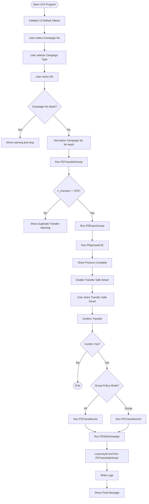

---

## 5. Sequence Diagram

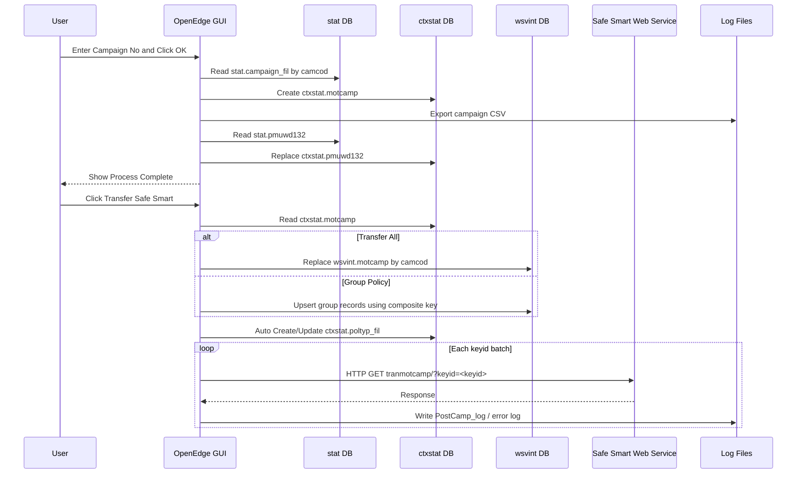

---

## 6. Main Process: เมื่อกดปุ่ม OK (`buok`)

### Step 1: ตรวจสอบ Campaign No.

ถ้า `fi_camp` ว่าง โปรแกรมแสดงข้อความเตือน:

```text
Campaign No. เป็นค่าว่าง !!!
```

ถ้าไม่ว่างจะไปขั้นตอนต่อไป

---

### Step 2: Normalize Campaign No. สำหรับสร้าง `keyid`

โปรแกรมลบอักขระพิเศษออกจาก Campaign No.

```progress
nv_campaig = REPLACE(fi_camp,"/","").
nv_campaig = REPLACE(nv_campaig,"-","").
nv_campaig = REPLACE(nv_campaig,"+","").
nv_campaig = REPLACE(nv_campaig,"_","").
```

ตัวอย่าง:

```text
fi_camp    = CAM-001/2026
nv_campaig = CAM0012026
```

---

### Step 3: Transfer Campaign จาก `stat.campaign_fil` ไป `ctxstat.motcamp`

เรียก Procedure:

```progress
RUN PDTransMotCamp.
```

Procedure นี้จะ:

1. Reset Counter
2. Generate `nv_datetoday`
3. Loop ข้อมูล `stat.campaign_fil` ตาม `fi_camp`
4. ตรวจสอบว่ามีข้อมูลซ้ำใน `ctxstat.motcamp` หรือไม่
5. ถ้าไม่ซ้ำ จะ Create `ctxstat.motcamp`
6. Map Field จำนวนมากจาก `campaign_fil` ไป `motcamp`
7. Generate `keyid`
8. เพิ่ม Counter จำนวน Record
9. จัดกลุ่ม keyid ทุก 500 Records

---

### Step 4: ถ้า Transfer ซ้ำ ให้หยุด Process

ถ้าพบว่ามีข้อมูลใน `ctxstat.motcamp` แล้ว โปรแกรมตั้งค่า:

```progress
n_checkerr = NO.
```

และแสดงข้อความว่า Campaign เคย Transfer แล้ว พร้อมแนะนำให้:

1. กด DEL Campaign ก่อน แล้ว Transfer ใหม่
2. ตั้งชื่อ Campaign No. ใหม่

---

### Step 5: Export Campaign CSV

ถ้า `n_checkerr = YES` โปรแกรมเรียก:

```progress
RUN PDExportCamp.
```

ซึ่งจะ:

1. เรียก `PDHeaderCamp` เพื่อเขียน Header
2. Loop `ctxstat.motcamp` ตาม Campaign No.
3. Export เป็น Pipe Delimiter `|` ไปยัง `fi_output`

ค่า Default ของ Output File:

```text
D:\temp\TrnCamp<YYYYMMDD>.csv
```

---

### Step 6: Copy Premium Detail

เรียก:

```progress
RUN PDpmuwd132.
```

Procedure นี้ copy ข้อมูลจาก:

```text
stat.pmuwd132 -> ctxstat.pmuwd132
```

ถ้ามีข้อมูลเดิมใน `ctxstat.pmuwd132` จะลบก่อนแล้วสร้างใหม่

---

### Step 7: แสดงผล Process Complete

หลังทำงานครบ แสดง:

```text
Process Complete
```

จากนั้นปรับ UI โดย Disable ปุ่ม/Field บางตัว เพื่อป้องกันแก้ไข Campaign No. หลัง Process แล้ว

---

## 7. Procedure: `PDTransMotCamp`

### Purpose

นำข้อมูลจาก `stat.campaign_fil` ไปสร้างเป็น `ctxstat.motcamp` สำหรับ Campaign ที่ระบุ

### Flow Diagram

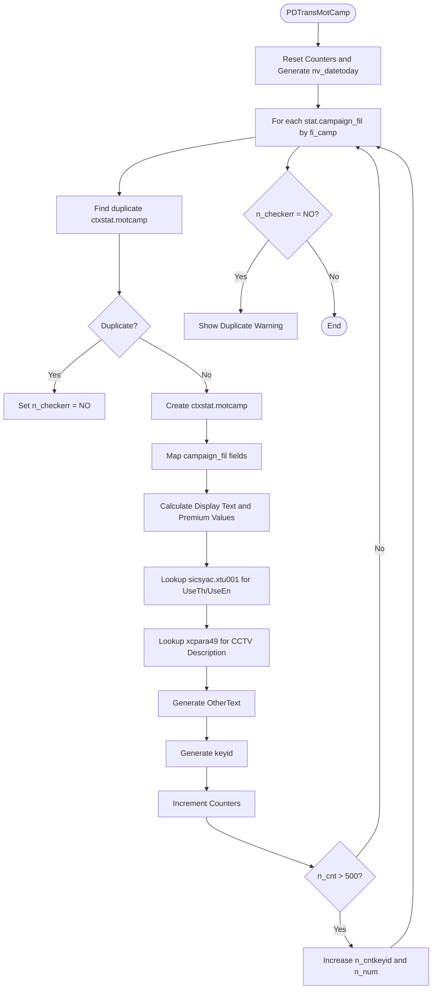

### Key Mapping Groups

| Source | Target | Description |
|---|---|---|
| `stat.campaign_fil.camcod` | `ctxstat.motcamp.camcod` | Campaign Code |
| `stat.campaign_fil.camnam` | `ctxstat.motcamp.camnam` | Campaign Name |
| `stat.campaign_fil.polmst` | `ctxstat.motcamp.polmst` | Policy Master |
| `stat.campaign_fil.class/sclass/covcod` | `ctxstat.motcamp.class/sclass/covcod` | Class / Coverage |
| `stat.campaign_fil.engine/seats/tons` | `ctxstat.motcamp.engine/seats/tons` | Vehicle Capacity |
| `stat.campaign_fil.baseprm/netprm/grossprm` | `ctxstat.motcamp.baseprm/netprem/grossprem` | Premium |
| `stat.campaign_fil.dedod/dedad/dedpd` | `ctxstat.motcamp.dedod/dedad/dedpd` | Deductible |
| `stat.campaign_fil.fletamt/ncbamt/dspcamt/stfamt` | `ctxstat.motcamp.FleetPrem/NcbPrem/DiscPrem` | Discount |
| Generated | `ctxstat.motcamp.keyid` | Key สำหรับยิง Web Service |

### Key Business Logic

#### Generate `nv_datetoday`

โปรแกรมสร้าง `nv_datetoday` จากวันที่ปัจจุบัน โดยใช้ Pattern:

```text
YYYYDDMM
```

เช่น 20 July 2026:

```text
20262007
```

#### Generate `keyid`

```progress
ctxstat.motcamp.keyid = nv_campaig + nv_datetoday + STRING(n_num).
```

ตัวอย่าง:

```text
CAM001202620071
```

#### Split Keyid ทุก 500 Records

ถ้า `n_cnt > 500`:

- เพิ่ม `n_cntkeyid`
- เพิ่ม `n_num`
- reset `n_cnt = 0`

ใช้สำหรับแบ่งการยิง Web Service เป็นชุด ๆ

---

## 8. Procedure: `PDExportCamp` และ `PDHeaderCamp`

### Purpose

Export ข้อมูลจาก `ctxstat.motcamp` ไปยัง CSV / Pipe Delimiter File

### Flow

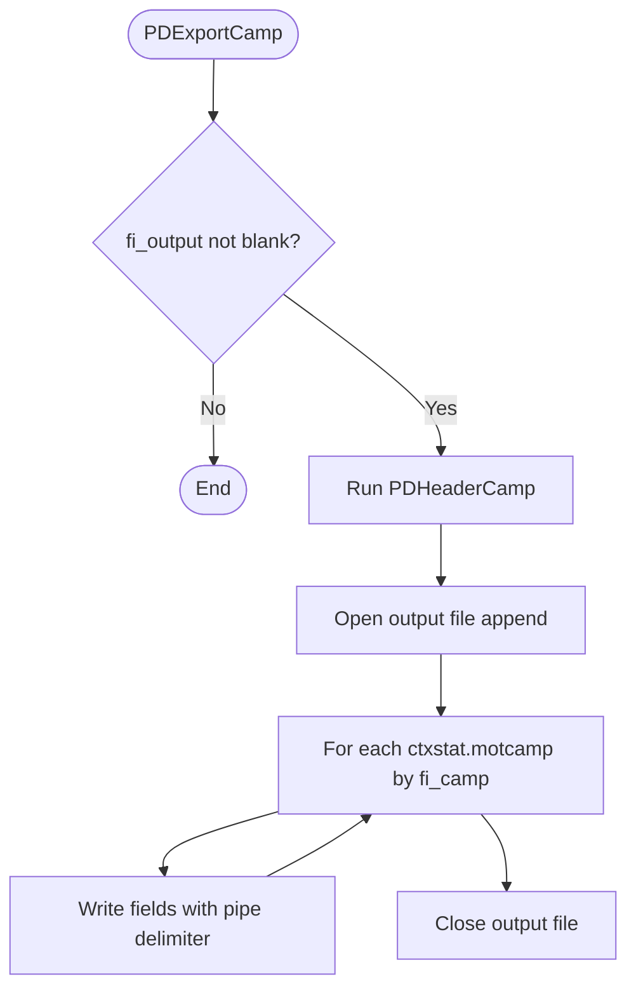

### Output File

Default:

```text
D:\temp\TrnCamp<YYYYMMDD>.csv
```

### Output Format

ข้อมูลถูกคั่นด้วย `|`

```text
camcod|camnam|paccod|class|sclass|covcod|...
```

---

## 9. Procedure: `PDpmuwd132`

### Purpose

Copy Premium Detail จาก `stat.pmuwd132` ไปยัง `ctxstat.pmuwd132`

### Flow

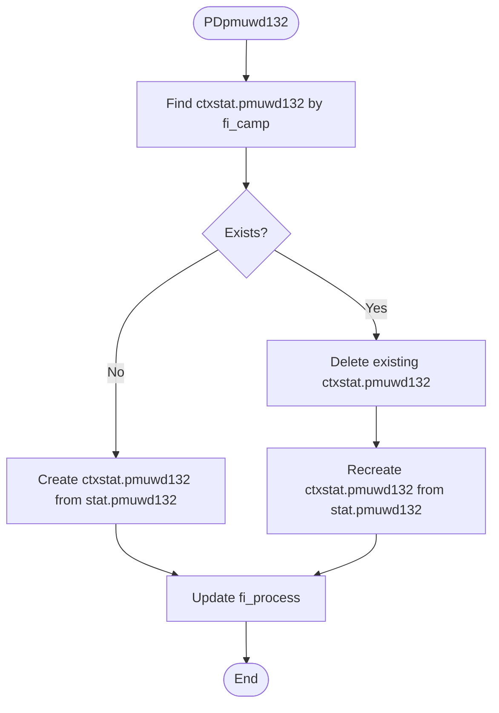

### Key Behavior

- ถ้า `ctxstat.pmuwd132` ยังไม่มีข้อมูล จะ Create ใหม่จาก `stat.pmuwd132`
- ถ้ามีข้อมูลเดิม จะ Delete ทั้งหมดตาม `campcd = fi_camp` ก่อน แล้ว Create ใหม่
- `effdat` ถูก Set เป็น `TODAY` แทนการใช้ `stat.pmuwd132.effdat`

---

## 10. Procedure: `PDSetCampaign`

### Purpose

Auto Set Campaign Parameter ใน `ctxstat.poltyp_fil` แทนการเข้าไป Set Manual ที่ Motor Citrix เมนู Package Type Maintenance

### Flow

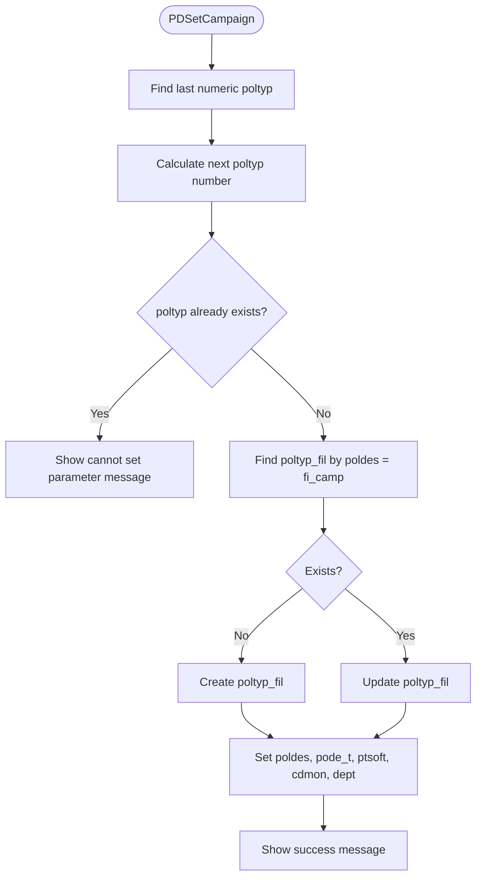

### Important Fields

| Field | Value |
|---|---|
| `poltyp` | Next numeric campaign parameter id |
| `poldes` | `n_camcod` |
| `pode_t` | `n_camnam` |
| `ptsoft` | `nv_campaigntype` (`C` หรือ `S`) |
| `cdmon` | `n_effectivedate` |
| `dept` | `n_expirydate` |

---

## 11. Transfer Safe Smart Flow (`nv_trans_safe`)

เมื่อ User กดปุ่ม **Transfer Safe Smart** โปรแกรมถามยืนยันก่อนทำงาน

### Flow Diagram

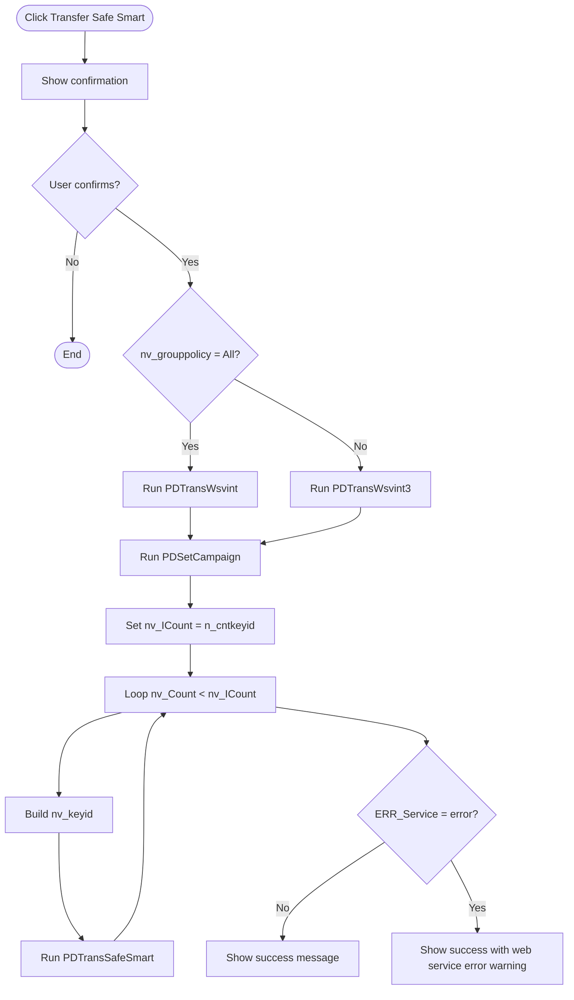

### Key Logic

```progress
IF nv_grouppolicy = 'All' THEN
    RUN PDTransWsvint.
ELSE
    RUN PDTransWsvint3.
```

หลังจากนั้นจะเรียก:

```progress
RUN PDSetCampaign.
```

และยิง Web Service ตามจำนวน `keyid` ที่ Generate ไว้

---

## 12. Procedure: `PDTransWsvint` / `PDTransWsvint2`

### Purpose

Transfer ข้อมูลจาก `ctxstat.motcamp` ไป `wsvint.motcamp` แบบ All Policy Master

### Behavior

- `PDTransWsvint` ตรวจว่ามี `wsvint.motcamp` ของ Campaign นี้อยู่แล้วหรือไม่
- ถ้าไม่มี จะ Create ใหม่จาก `ctxstat.motcamp`
- ถ้ามี จะเรียก `PDTransWsvint2`
- `PDTransWsvint2` จะ Delete `wsvint.motcamp` เดิมทั้งหมดตาม `camcod = fi_camp` แล้ว Create ใหม่

### Flow

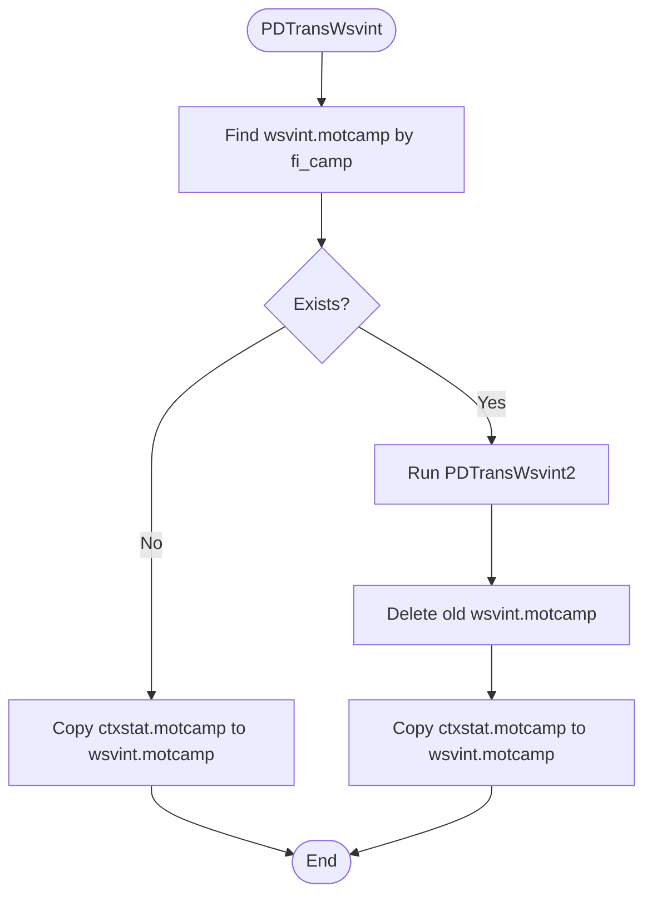

---

## 13. Procedure: `PDTransWsvint3` / `PDTransWsvint4`

### Purpose

Transfer ข้อมูลจาก `ctxstat.motcamp` ไป `wsvint.motcamp` แบบ Group Policy Master

### Difference from All Mode

Group Mode จะตรวจ Duplicate ด้วย Composite Key เช่น:

- `camcod`
- `sclass`
- `makeyr`
- `simin`
- `simax`
- `mincst`
- `maxcst`

และกำหนด:

```progress
wsvint.motcamp.makedes = "".
wsvint.motcamp.modeldes = "".
```

### Flow

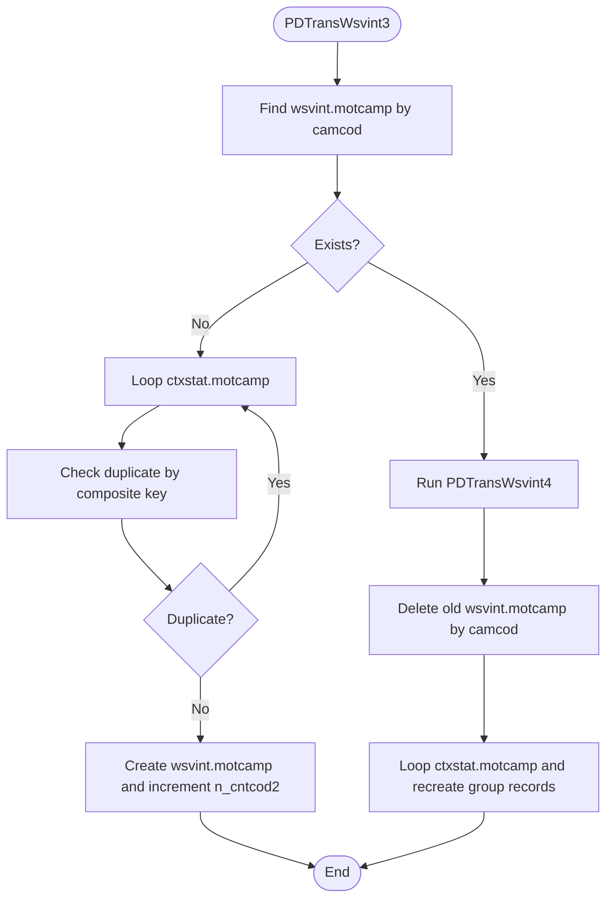

---

## 14. Procedure: `PDTransSafeSmart`

### Purpose

เรียก Web Service Safe Smart เพื่อให้ระบบปลายทาง Process Campaign ตาม `keyid`

### Flow

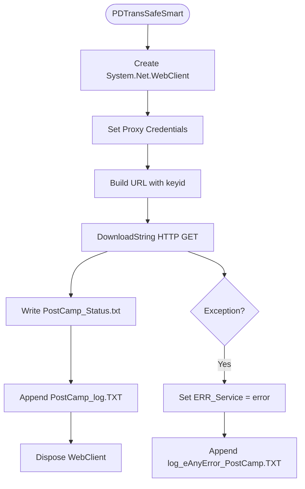

### Web Service URL

UAT URL:

```text
http://10.35.1.155:8080/styweb-online-test/tranmotcamp/?keyid=<PostKeyid>
```

Production URL ถูก Comment ไว้:

```text
http://10.35.1.155:8080/styweb-online/tranmotcamp/?keyid=<PostKeyid>
```

### Logs

| Log File | Purpose |
|---|---|
| `PostCamp_Status.txt` | เก็บ Response ล่าสุดจาก Web Service |
| `PostCamp_log.TXT` | Log การยิง Web Service สำเร็จ |
| `log_eAnyError_PostCamp.TXT` | Log Error จาก Web Service / HTTP Exception |

---

## 15. Delete Campaign Flow (`budel`)

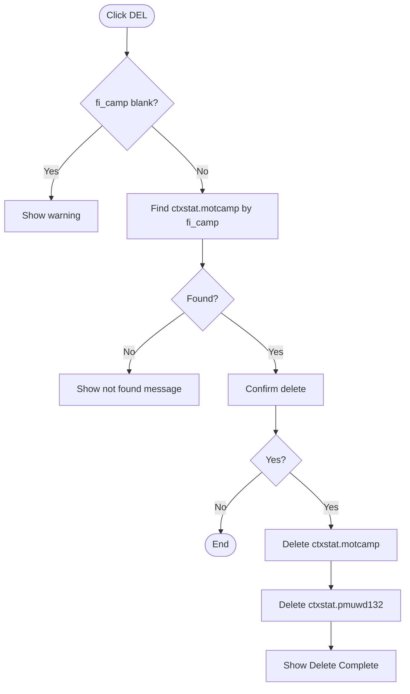

---

## 16. Process Summary แบบเรียงลำดับทีละข้อ

### A. Initial Screen

1. Program สร้าง Window และ Frame `fr_main`
2. Program Enable UI ด้วย `RUN enable_UI`
3. Program ตั้งค่า Default `fi_output = D:\temp\TrnCamp<YYYYMMDD>.csv`
4. Program ตั้งค่า Campaign Type เป็น `C` หรือแคมเปญกลาง
5. Program ตั้งค่า Group Policy Mode เป็น `All`
6. Program รอ User กรอก Campaign No.

### B. OK Button Process

1. User ระบุ `fi_camp`
2. User กดปุ่ม OK
3. Program ตรวจสอบว่า `fi_camp` ว่างหรือไม่
4. Program Normalize `fi_camp` เป็น `nv_campaig` สำหรับสร้าง `keyid`
5. Program เรียก `PDTransMotCamp`
6. `PDTransMotCamp` อ่านข้อมูลจาก `stat.campaign_fil`
7. Program ตรวจสอบ Duplicate ใน `ctxstat.motcamp`
8. ถ้าไม่ Duplicate ให้ Create `ctxstat.motcamp`
9. Program Map Field จาก `campaign_fil` ไป `motcamp`
10. Program Generate `keyid`
11. Program Count จำนวน Record ที่ Transfer
12. ถ้ามากกว่า 500 Record ให้เพิ่มชุด `keyid`
13. ถ้าไม่มี Duplicate Program เรียก `PDExportCamp`
14. `PDExportCamp` เขียน Header และ Detail CSV
15. Program เรียก `PDpmuwd132`
16. `PDpmuwd132` Copy `stat.pmuwd132` ไป `ctxstat.pmuwd132`
17. Program แสดง `Process Complete`

### C. Transfer Safe Smart Process

1. User กดปุ่ม Transfer Safe Smart
2. Program แสดง Confirm Dialog
3. ถ้า User เลือก No จะไม่ทำงานต่อ
4. ถ้า User เลือก Yes จะตรวจ `nv_grouppolicy`
5. ถ้า `All` เรียก `PDTransWsvint`
6. ถ้า `Group` เรียก `PDTransWsvint3`
7. Program Copy หรือ Replace ข้อมูลจาก `ctxstat.motcamp` ไป `wsvint.motcamp`
8. Program เรียก `PDSetCampaign`
9. `PDSetCampaign` Create/Update `ctxstat.poltyp_fil`
10. Program เตรียมจำนวน `keyid` ที่ต้องยิง Web Service จาก `n_cntkeyid`
11. Program Loop ยิง Web Service ด้วย `PDTransSafeSmart`
12. `PDTransSafeSmart` เรียก URL Safe Smart ด้วย `keyid`
13. Program เขียน Response ลง `PostCamp_Status.txt`
14. Program Append Log ลง `PostCamp_log.TXT`
15. ถ้า Error จะเขียน `log_eAnyError_PostCamp.TXT` และ Set `ERR_Service = error`
16. Program แสดงข้อความจบ Process พร้อมให้ User ตรวจสอบ Log

### D. Delete Campaign Process

1. User กดปุ่ม DEL
2. Program ตรวจสอบว่า `fi_camp` ว่างหรือไม่
3. Program หา `ctxstat.motcamp` ตาม Campaign No.
4. ถ้าไม่พบจะแสดง Message
5. ถ้าพบจะถาม Confirm
6. ถ้า Confirm Yes จะ Delete `ctxstat.motcamp`
7. Program Delete `ctxstat.pmuwd132`
8. Program แสดง Delete Complete

---

## 17. Technical Findings / Recommendations

### 17.1 Hardcoded URL / Environment

Web Service URL ถูก Hardcode เป็น UAT และ Production ถูก Comment ไว้ ควรย้ายไป Config เช่น `AppConfig` เพื่อป้องกันการ Compile ผิด Environment

### 17.2 Hardcoded Credentials

มี User/Password เช่น `pdmgr0` อยู่ใน Source Code ควรย้ายไป Secure Config หรือ Credential Store

### 17.3 ไม่มี Transaction Scope สำหรับ Multi-table Transfer

การ Transfer เกี่ยวข้องกับหลาย Table เช่น `ctxstat.motcamp`, `ctxstat.pmuwd132`, `wsvint.motcamp`, `ctxstat.poltyp_fil` ควรพิจารณาใช้ Transaction ตาม Campaign เพื่อป้องกัน Partial Update

### 17.4 Duplicate Handling เข้มงวดที่ `ctxstat.motcamp`

ถ้าเจอ Campaign ซ้ำจะหยุดและแจ้งให้ User DELETE ก่อน อาจเหมาะกับ Manual Control แต่ถ้าต้องการ Re-run อัตโนมัติควรเพิ่ม Mode `Replace` หรือ `Reprocess`

### 17.5 Keyid Date Format ควรตรวจสอบ

`nv_datetoday` ถูกสร้างเป็น `YYYYDDMM` ไม่ใช่ `YYYYMMDD` ควรยืนยันกับ Safe Smart ว่าเป็น Format ที่ต้องการจริง

### 17.6 HTTP Call ไม่มี Retry

`PDTransSafeSmart` ไม่มี Retry หาก Web Service ล้มเหลว ควรเพิ่ม Retry 3 ครั้ง พร้อม Delay และ Log รายรอบ

### 17.7 Export File ใช้ `APPEND`

ทั้ง Header และ Detail ใช้ `APPEND` ทำให้ถ้าไฟล์เดิมมีข้อมูลอยู่ อาจต่อข้อมูลซ้ำ ควรเคลียร์ไฟล์ก่อน Export หรือ Generate File Name ใหม่แบบละเอียดถึงเวลา

### 17.8 `PDpmuwd132` อ้าง `ctxstat.pmuwd132` หลัง Loop

ท้าย Procedure มี:

```progress
fi_process = ctxstat.pmuwd132.campcd + " " + ctxstat.pmuwd132.policy.
```

ควรระวังกรณีไม่มี Record หรือ Record ถูก Release แล้ว อาจทำให้ Reference ไม่ชัดเจน

### 17.9 Repeated Mapping Code

`PDTransWsvint`, `PDTransWsvint2`, `PDTransWsvint3`, `PDTransWsvint4` มี Mapping ซ้ำจำนวนมาก ควร Refactor เป็น Procedure กลาง เช่น `CopyMotcampToWsvint`

---

## 18. Recommended Improved Flow

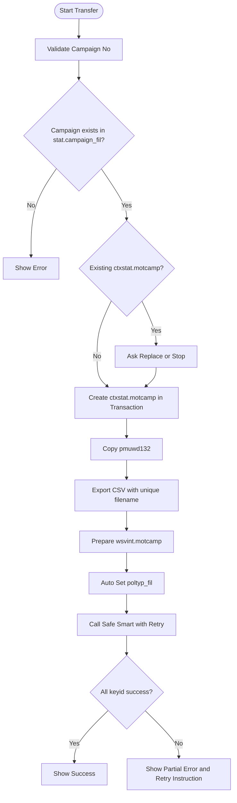

---

## 19. Business Summary

โปรแกรมนี้เป็นเครื่องมือ Manual สำหรับนำ Campaign ที่สร้างไว้ในระบบ `stat` ไป Publish ให้ Safe Smart ผ่านขั้นตอน Staging และ Interface Table โดย User ต้องเลือก Campaign No. แล้วกด Process ตามลำดับ

Flow หลักคือ:

1. สร้างข้อมูล Motor Campaign ที่ `ctxstat.motcamp`
2. Export เพื่อตรวจสอบ
3. Copy Premium Detail
4. Transfer ไป `wsvint.motcamp`
5. Auto Set Campaign Parameter
6. ยิง Web Service Safe Smart ด้วย `keyid`

โปรแกรมมีการป้องกัน Transfer ซ้ำโดยบังคับให้ User ลบข้อมูลเดิมก่อน หรือใช้ Campaign No. ใหม่ ซึ่งเหมาะกับงาน Manual Control แต่ควรเพิ่ม Error Handling, Retry และ Config แยก Environment สำหรับการใช้งาน Production อย่างปลอดภัย
